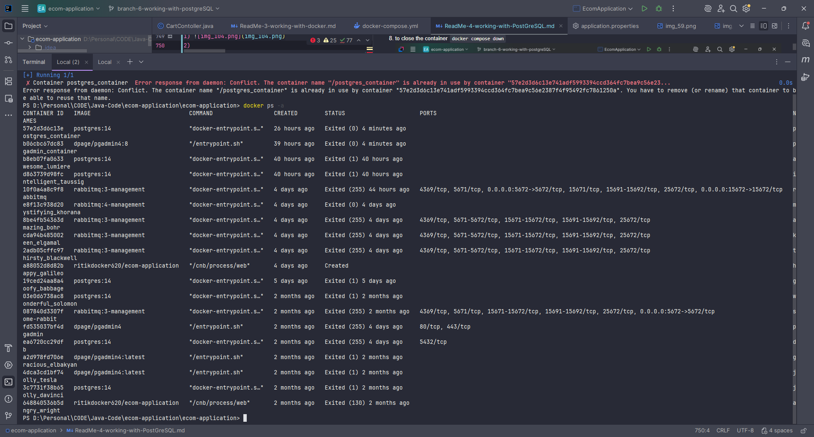
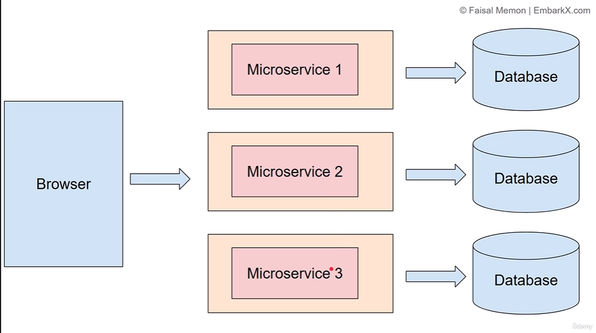
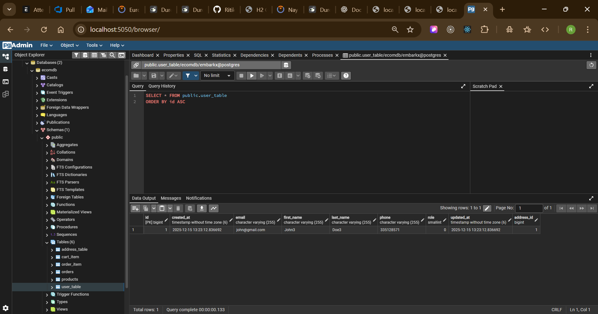
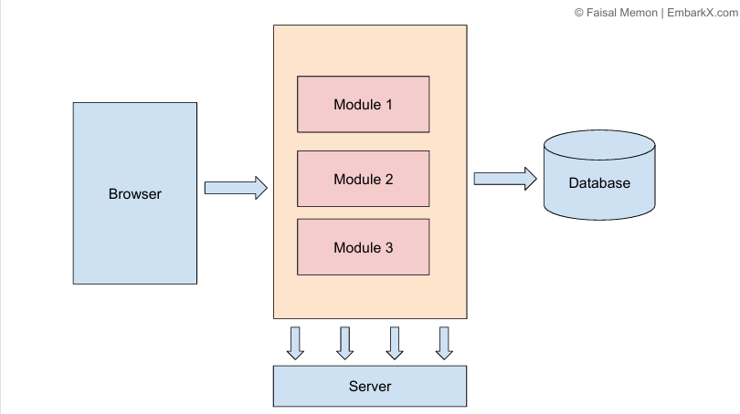
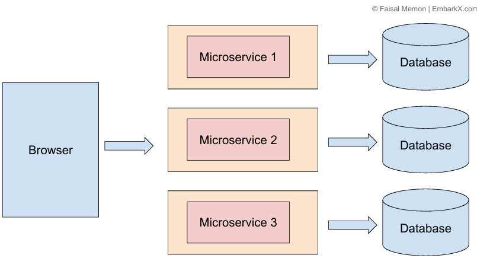
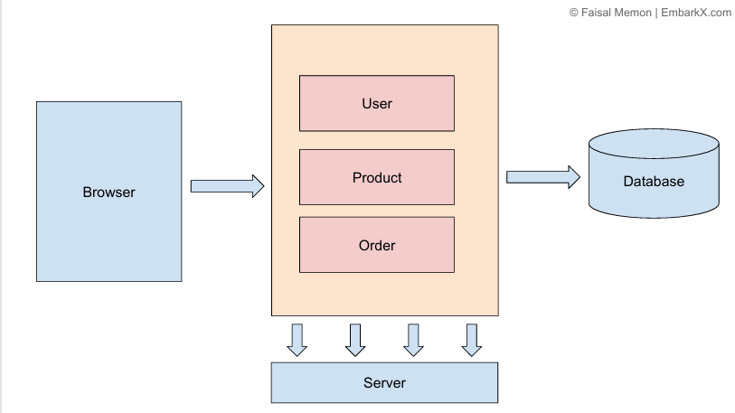
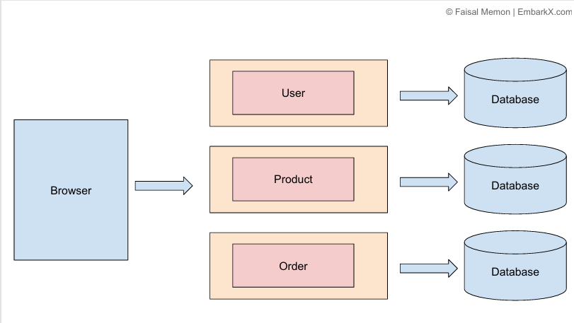
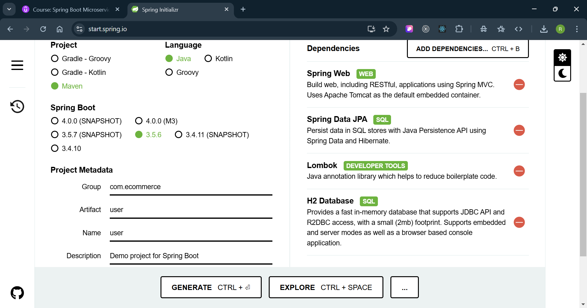

Great question 👍 Let’s go step by step, because understanding **Microservices Architecture** requires knowing **how software architecture evolved**.
Here are **complete notes (0–100)** for you:

---

# 🏗️ Software Architecture – Evolution Before Microservices

### 1. **Monolithic Architecture**

* **Definition**: Entire application built as **one unit** (all features together).
* **Characteristics**:

    * Single codebase.
    * One deployment file (WAR, JAR, EXE).
    * All modules (UI, business logic, database access) tightly coupled.
* **Advantages**:

    * Simple to develop and deploy.
    * Easy debugging (since one codebase).
    * Best for **small projects**.
* **Disadvantages**:

    * Hard to scale (you must scale entire app even if one feature needs more resources).
    * Tight coupling → a change in one module can break the whole app.
    * Longer build/test/deployment cycle.
    * Difficult for large teams (code conflicts).

👉 Mostly used in **early stage or small applications**.

---

### 2. **Layered Architecture (N-Tier Architecture)**

* **Definition**: Application divided into logical layers:

    * **Presentation Layer** (UI)
    * **Business Layer** (Service/Logic)
    * **Persistence Layer** (Database access)
    * **Database Layer**
* **Advantages**:

    * Separation of concerns → better organization.
    * Easier testing & maintainability.
* **Disadvantages**:

    * Still often deployed as **one monolith**.
    * Can become complex for scaling.

👉 Still widely used in **enterprise systems** (Spring MVC, ASP.NET apps).

---

### 3. **SOA (Service-Oriented Architecture)**

* **Definition**: Applications are divided into **services** that communicate via a service bus (ESB).
* **Advantages**:

    * Reusable services.
    * Loose coupling between systems.
* **Disadvantages**:

    * Heavyweight (requires ESB, lots of governance).
    * Complex to implement.

👉 Used in large **enterprise systems** before microservices.

---

# 🚀 Microservices Architecture

### **Definition**

* Microservices is a **software architectural style** where an application is broken down into **small, loosely coupled, independently deployable services**, each handling a **specific business capability**.

### **Key Features**

1. **Independence** → Each service can be developed, deployed, and scaled independently.
2. **Loose Coupling** → Services interact only via APIs (usually REST, gRPC, or messaging).
3. **Decentralized Data** → Each microservice often has its own database.
4. **Polyglot** → Different services can use different programming languages/technologies.
5. **DevOps Friendly** → Works great with CI/CD pipelines and containerization (Docker, Kubernetes).

---

### **Why Microservices?**

* To solve the **problems of monolithic architecture**:

    * Faster deployments.
    * Independent scaling.
    * Fault isolation (failure in one service doesn’t break the whole system).
    * Easier to adopt new technologies service-by-service.
* Supports **agile development** (different teams own different services).

---

### **Advantages**

✅ Independent development & deployment.
✅ High scalability (scale only needed services).
✅ Resilient & fault-tolerant.
✅ Easier maintenance with smaller codebases.
✅ Parallel team development.
✅ Better suited for cloud-native environments (Docker, Kubernetes).

---

### **Disadvantages**

❌ Higher complexity in setup & management.
❌ Requires API management & service discovery.
❌ Network latency (since services talk via network).
❌ Data consistency challenges (distributed transactions are hard).
❌ DevOps & monitoring overhead (need logging, tracing, monitoring across many services).

---

# 📍 When to Use Microservices

* ✅ Large, complex applications with multiple business domains.
* ✅ Applications requiring frequent updates/deployments.
* ✅ When scaling different parts of the system differently (e.g., payments need more resources than notifications).
* ✅ For cloud-native, containerized systems (Docker, Kubernetes).

# 📍 When NOT to Use Microservices

* ❌ Small/simple applications (monolith is faster & cheaper).
* ❌ Teams not experienced with DevOps/CI/CD.
* ❌ Projects with very limited budget/time.

---

# 🏗️ Microservices Architecture Components

1. **API Gateway** → Single entry point (routes requests to services).
2. **Service Registry & Discovery** → Keeps track of available services.
3. **Load Balancer** → Distributes requests.
4. **Config Server** → Centralized configuration management.
5. **Database per Service** → Each service owns its data.
6. **Communication** → REST, gRPC, Message Queue (Kafka, RabbitMQ).
7. **Monitoring & Logging** → Prometheus, Grafana, ELK stack.
8. **Containerization** → Docker & orchestration with Kubernetes.

---

# 📝 Quick Comparison

| Feature         | Monolithic | Microservices |
| --------------- | ---------- | ------------- |
| Deployment      | One unit   | Independent   |
| Scaling         | Whole app  | Per service   |
| Fault isolation | Hard       | Easy          |
| Tech stack      | Single     | Multiple      |
| Best for        | Small apps | Large apps    |

---

✅ **Conclusion**:

* **Start small with Monolithic** if app is simple.
* **Use Microservices** when application grows in size, features, and requires **independent scaling and deployment**.

---

👉 Do you want me to also create a **diagram showing how microservices architecture works vs monolithic** (with API Gateway, services, DB, etc.) so it’s easier to visualize?
Perfect 👍 Let’s go step by step and build **complete notes** on this:

---

# 📘 Software Architecture & Microservices

## 1. What is Software Architecture?

Software Architecture is the **blueprint of a system**.
It defines how software components are structured, how they interact, and the principles guiding the system’s design and evolution.

👉 In simple terms: **It is the design plan of software just like an architect’s design plan of a building.**

---

## 2. Why Do We Need Software Architecture?

* Provides **clarity** on how the system will be built.
* Helps in **scalability** (handling more users, features).
* Improves **maintainability** (easy to update and debug).
* Ensures **reusability** of components.
* Helps in **decision-making** for technologies, databases, APIs, and security.

---

## 3. Common Software Architecture Styles (Before Microservices)

### 🔹 a) **Monolithic Architecture**

* Entire application built as **one large unit**.
* Example: Traditional Spring Boot or Java EE applications where UI, business logic, and database code are in a single package.

**Advantages:**
✔ Simple to develop and deploy.
✔ Easier debugging (all in one place).

**Disadvantages:**
❌ Hard to scale specific parts.
❌ A small change requires re-deploying the whole app.
❌ Becomes complex as the application grows.

---

### 🔹 b) **Layered Architecture (N-tier)**

* Most common design (Presentation → Business Logic → Data Access → Database).
* Example: A Spring Boot MVC application.

**Advantages:**
✔ Separation of concerns.
✔ Easier testing.

**Disadvantages:**
❌ Can become slow due to multiple layers.
❌ Not flexible for very large systems.

---

### 🔹 c) **Event-Driven Architecture**

* Components communicate through **events** (publish/subscribe model).
* Example: Kafka or RabbitMQ-based systems.

**Advantages:**
✔ Decoupling between services.
✔ Handles asynchronous workflows.

**Disadvantages:**
❌ Harder to debug.
❌ Requires event management tools.

---

### 🔹 d) **Service-Oriented Architecture (SOA)**

* System broken into **services**, but services are **large and tightly coupled** compared to microservices.

**Advantages:**
✔ Better modularity than monolithic.
✔ Reusable services.

**Disadvantages:**
❌ Heavy communication overhead.
❌ Less flexible than microservices.

---

## 4. Microservices Architecture (Modern Approach)

### 📌 What is Microservices?

Microservices is an architectural style where an application is built as a **collection of small, independent services**, each focusing on a single business function (e.g., user service, order service, payment service).

👉 Each service runs in its own **process**, communicates via **APIs (usually REST or gRPC)**, and can be deployed independently.

---

### 📌 Why Use Microservices?

* **Scalability** → Scale individual services instead of whole app.
* **Flexibility** → Different services can use different languages/technologies.
* **Faster development** → Teams work independently.
* **Resilience** → If one service fails, others can still run.
* **Deployment agility** → Independent deployment with Docker & Kubernetes.

---

### 📌 Advantages of Microservices

✔ Independent deployment.
✔ Technology diversity (Java for one service, Node.js for another).
✔ Better fault isolation.
✔ CI/CD friendly.

---

### 📌 Disadvantages of Microservices

❌ More complex (service discovery, communication, monitoring needed).
❌ Requires DevOps maturity (Docker, Kubernetes, CI/CD).
❌ Data consistency challenges across services.
❌ More resources (multiple services running).

---

## 5. Why Microservices with Spring Boot?

Spring Boot + Microservices is very popular because:

* Spring Boot is lightweight and easy for building REST APIs.
* Spring Cloud provides tools for microservice patterns (Service Discovery, Config Server, API Gateway, etc.).
* Works seamlessly with Docker & Kubernetes.
* PostgreSQL / MySQL can be used independently per service.

---

✅ **Summary:**

* Earlier, systems were designed as **Monolithic or Layered**.
* With scalability needs, we moved to **SOA** and **Event-driven**.
* Now, **Microservices** is the modern solution for large, scalable, cloud-based apps.

---

Would you like me to also create a **visual diagram** that compares **Monolithic vs SOA vs Microservices** architecture? That way, it’ll be crystal clear.
1) 
1) exmaple of monolithic architechture: below
2) 

# ----- Problems of Monolithic Architecture -------
Great question 👍

A **monolithic architecture** means your whole application is built as a **single, tightly coupled unit**. While it’s simple to start with, it comes with several **problems as the system grows**:

---

### 🔴 Problems of Monolithic Architecture

1. **Tight Coupling & Lack of Flexibility**

    * All modules are bundled together, so a change in one part can affect the whole system.
    * Difficult to adopt new technologies without rewriting large portions.

2. **Scalability Issues**

    * You can only scale the entire application, not just the parts that need more resources.
    * Example: If only the “order service” needs more load handling, you still have to scale the whole app.

3. **Slower Development**

    * As the codebase grows, onboarding new developers becomes harder.
    * Development slows down due to dependencies between modules.

4. **Deployment Challenges**

    * Even for a small change, you must build and redeploy the entire application.
    * Increases downtime and deployment risks.

5. **Limited Reliability**

    * If one module fails, it can crash the entire application.
    * No fault isolation between different components.

6. **Testing Complexity**

    * Running integration tests requires the whole system to be up and running.
    * Unit testing gets harder with strong coupling.

7. **Technology Lock-In**

    * Since everything is bundled, migrating to a new tech stack (e.g., database, framework) is difficult.
    * You can’t easily use different technologies for different modules.

8. **Large Codebase Maintenance**

    * Becomes messy and harder to maintain over time.
    * Risk of “spaghetti code” as multiple teams work on the same repository.

---

✅ That’s why many modern systems move towards **microservices architecture**, where each service is independent, deployable on its own, and can scale individually.

Do you want me to also list the **advantages of microservices over monolithic** so you can compare them clearly?
Perfect 👍 Let’s compare them side by side so it’s crystal clear.

---

## 🔴 Problems of Monolithic Architecture

1. **Tightly Coupled** – one change can break the whole app.
2. **Hard to Scale** – must scale the entire app, even if only one part needs it.
3. **Slow Development** – large codebase, hard for teams to work in parallel.
4. **Deployment Risk** – even a small change requires redeploying everything.
5. **Low Reliability** – failure in one module can crash the whole app.
6. **Difficult Testing** – need the whole system running to test.
7. **Technology Lock-in** – hard to mix different tech stacks.
8. **Maintenance Issues** – messy over time, “spaghetti code” risk.

---

## 🟢 Advantages of Microservices Architecture

1. **Loose Coupling & Flexibility**

    * Each service is independent, changes don’t affect the whole system.

2. **Scalability**

    * You can scale only the services that need more resources (e.g., payment service, search service).

3. **Faster Development**

    * Different teams can work on different services in parallel.
    * Smaller codebases are easier to manage.

4. **Independent Deployment**

    * Deploy only the changed service, no need to redeploy everything.

5. **Fault Isolation**

    * If one microservice fails, others can still run.
    * Improves system reliability.

6. **Technology Diversity**

    * Each service can use the best technology for its purpose (Java, Node.js, Python, different databases).

7. **Better Testing**

    * Easy to test small services individually.

8. **Easier Maintenance**

    * Smaller, modular codebases are easier to understand and maintain.

---

⚖️ **In short:**

* Monolithic is simple to start but painful to scale and maintain in the long run.
* Microservices add complexity (like service communication, deployment pipelines, monitoring), but they solve the scalability, reliability, and flexibility problems of monoliths.

---
1) image of microservice below
2) 

---

## ⚠️ Challenges of Microservices Architecture

1. **Increased Complexity**

    * Instead of one app, you now manage many small services.
    * Requires handling service discovery, communication, and versioning.

2. **Data Management**

    * In monolith: one database for all.
    * In microservices: each service may have its own DB → leads to data consistency challenges.
    * Must use patterns like **event-driven architecture** or **sagas** for transactions.

3. **Communication Overhead**

    * Services talk over network (REST, gRPC, messaging).
    * Adds **latency** and possible failures compared to in-memory calls in a monolith.

4. **Deployment & DevOps Complexity**

    * Requires CI/CD pipelines, Docker, Kubernetes, service orchestration.
    * Harder than just deploying one JAR/WAR file.

5. **Monitoring & Debugging**

    * In a monolith, logs are in one place.
    * In microservices, logs are spread across services.
    * Needs distributed tracing, centralized logging (ELK, Prometheus, Grafana).

6. **Testing Difficulties**

    * Unit testing is easy, but integration testing across multiple services is tricky.
    * Requires test environments with all dependent services running.

7. **Team & Skill Requirements**

    * Developers need to know DevOps, containerization, distributed systems.
    * Smaller teams might struggle to handle the complexity.

8. **Deployment Cost**

    * Each service might run in its own container/VM.
    * More resource usage compared to a single monolith.

---

✅ **Summary:**

* Microservices are great for **large, scalable, distributed systems** with multiple teams.
* But for small-to-medium apps, the **added complexity might not be worth it**—a monolith or modular monolith could be better.

---

👉 Do you want me to make a **table comparison (Monolith vs Microservices)** so you can quickly revise it for interviews or documentation?
Perfect 👍 Here’s a clear **comparison table of Monolithic vs Microservices** (great for interviews, notes, or documentation):

---

## 📊 Monolithic vs Microservices

| Feature / Aspect      | Monolithic Architecture 🟥                      | Microservices Architecture 🟩                           |
| --------------------- | ----------------------------------------------- | ------------------------------------------------------- |
| **Structure**         | Single, tightly coupled application             | Collection of small, independent services               |
| **Scalability**       | Entire app must be scaled together              | Each service can be scaled independently                |
| **Deployment**        | One build & deploy for whole app                | Independent deployment per service                      |
| **Development Speed** | Slows down as app grows (large codebase)        | Faster with parallel development by teams               |
| **Technology Stack**  | Usually one tech stack for entire app           | Different services can use different tech stacks        |
| **Database**          | One shared database                             | Each service can have its own database                  |
| **Fault Tolerance**   | One failure can crash the whole app             | Failure isolated to the service, others still work      |
| **Testing**           | Easier unit & integration testing (single app)  | Harder integration testing (distributed system)         |
| **Maintainability**   | Becomes complex over time (spaghetti code risk) | Easier (small, focused codebases)                       |
| **Performance**       | Faster (in-memory calls)                        | Slower (network calls between services)                 |
| **DevOps Needs**      | Simple build & deploy pipeline                  | Requires CI/CD, containers, orchestration (Docker, K8s) |
| **Monitoring**        | Centralized logging, easy monitoring            | Needs distributed tracing & centralized logging tools   |
| **Team Suitability**  | Best for small teams / small apps               | Best for large teams / complex apps                     |
| **Cost**              | Lower infra & ops cost                          | Higher infra & ops cost                                 |

---

✅ **Rule of Thumb:**

* Small/startup project → Start with **Monolith** (or a modular monolith).
* Large, fast-growing, complex project → Move to **Microservices**.

---

👉 Do you want me to also explain the **transition path** (how companies move from Monolith → Microservices step by step)?
Nice 🚀 — this is a very **common interview & real-world question**: *“How do you migrate from a Monolithic architecture to Microservices?”*

Here’s a **step-by-step transition path** most companies follow:

---

## 🛠 Transition from Monolith → Microservices

### 1️⃣ Understand the Monolith

* Analyze the existing system (modules, dependencies, database schema).
* Identify tightly coupled parts vs. loosely coupled ones.
* Use tools like **static code analyzers** or **domain-driven design (DDD)** to break down domains.

---

### 2️⃣ Identify Microservice Candidates

* Don’t try to split everything at once.
* Pick **business capabilities** (e.g., `User Service`, `Order Service`, `Payment Service`).
* Start with modules that are:

    * Well-bounded
    * Frequently changing
    * Need independent scaling

---

### 3️⃣ Extract Services Gradually

* Create a new microservice for the chosen module.
* Keep the rest of the app monolithic.
* Use **API calls** (REST/gRPC) or **event-driven messaging** for communication between monolith & new service.

---

### 4️⃣ Manage the Database

* Monolith usually uses a single DB.
* Each microservice should have its **own database** (or schema).
* Start by giving microservices **read access** to the monolith DB, then gradually separate.
* Use patterns like **Database per Service** or **Shared Database (temporary)**.

---

### 5️⃣ Build Infrastructure

* Introduce **Docker & Docker Compose** for containers.
* For many services → move to **Kubernetes** or another orchestrator.
* Set up CI/CD pipelines for independent deployments.

---

### 6️⃣ Add Observability

* Implement centralized logging (ELK, Loki).
* Use distributed tracing (Jaeger, Zipkin).
* Add monitoring & metrics (Prometheus, Grafana).

---

### 7️⃣ Handle Cross-Cutting Concerns

* Authentication, authorization, rate limiting, security → usually managed via **API Gateway** (Kong, Nginx, Spring Cloud Gateway).
* Config management via **Config Server** or **Vault**.
* Service discovery via **Eureka, Consul, or Kubernetes DNS**.

---

### 8️⃣ Incremental Decomposition

* Continue extracting services one by one.
* Over time, the monolith shrinks, and more functionality moves into microservices.
* Eventually, you end up with a **distributed system**.

---

## 📌 Example (E-commerce App Transition)

1. Start with Monolith (all: users, orders, payments, products in one app).
2. Extract **User Service** (authentication, profile).
3. Extract **Order Service** (cart, checkout).
4. Extract **Payment Service** (transactions).
5. Slowly, the monolith only handles leftover modules → eventually retired.

---

✅ Key Advice: *Don’t rewrite the entire monolith in one go* — it’s risky. Use **Strangler Fig Pattern**: new microservices replace old parts gradually.

---

👉 Do you want me to also create a **diagram** showing Monolith → Hybrid (Monolith + Microservices) → Full Microservices, so it’s visually clear?
1) 

# problem of mono.. which is resovled by micro
Here’s a short description of **Monolithic problems** and how **Microservices solve them** in terms of scalability, flexibility, and simplicity:

---

### 🔹 Scalability

* **Monolithic**: Hard to scale — you must scale the entire application even if only one module needs more resources.
* **Microservices**: Easier to scale — each service can be scaled independently (e.g., only scale the payment service if needed).

---

### 🔹 Flexibility

* **Monolithic**: Tight coupling — all modules use the same tech stack, making it hard to adopt new frameworks/languages.
* **Microservices**: High flexibility — different services can use different tech stacks and databases best suited for them.

---

### 🔹 Simplicity (in Development & Deployment)

* **Monolithic**: Becomes complex as the codebase grows; deployment requires redeploying the entire app even for small changes.
* **Microservices**: Smaller, simpler services — independent deployment and development reduce complexity.

---

### 🔹 Problems of Monolithic solved by Microservices

1. **Scalability issue →** Independent scaling.
2. **Technology lock-in →** Polyglot flexibility (use best tech per service).
3. **Deployment bottlenecks →** Continuous delivery with independent deployments.
4. **Complexity with large teams →** Teams own services independently (faster development).
5. **Reliability issue →** Failure isolation (one service failing doesn’t crash the whole system).

---

👉 Would you like me to put this into a **clear comparison table** (Monolithic vs Microservices) so it’s easy to use for study/interview?

## ------------- Section 11: Microservices: Restructuring our application --------
1) we are going to re-structure the application from below one
2) 
3) to 
4)  means
5) 
6) 
7) so basically we are going to create three services so for that we need three port number to run each service as indepedent on that port.
8) create first user-Service model : for that create a new project select required dependeies and import it into IDE
9) 
9) 