# -- gives notes about JPA in Spring boot --
Got it 👍 Here are well-structured notes about **JPA (Java Persistence API) in Spring Boot** that you can use for study or projects:

---

# 📌 JPA in Spring Boot – Notes

## 1. What is JPA?

* **JPA (Java Persistence API)** is a specification for object-relational mapping (ORM) in Java.
* It provides a way to map Java objects (entities) to relational database tables.
* **Hibernate** is the most commonly used JPA implementation in Spring Boot.

---

## 2. Why Use JPA in Spring Boot?

* Eliminates boilerplate JDBC code.
* Provides CRUD operations with less effort.
* Supports relationships between tables using annotations.
* Allows switching databases easily (only change configuration).
* Works seamlessly with **Spring Data JPA** to reduce repository code.

---

## 3. Important JPA Annotations

### Entity Mapping

* `@Entity` → Marks a class as a JPA entity (table).
* `@Table(name = "table_name")` → Defines table name.

### Column Mapping

* `@Id` → Marks the primary key.
* `@GeneratedValue(strategy = …)` → Auto-generate IDs (IDENTITY, AUTO, SEQUENCE).
* `@Column(name = "column_name")` → Maps Java field to a database column.

### Relationships

* `@OneToOne`
* `@OneToMany`
* `@ManyToOne`
* `@ManyToMany`
* `@JoinColumn` → Defines foreign key.

### Other

* `@Transient` → Field not persisted.
* `@Embedded` / `@Embeddable` → For composite objects.

---

## 4. Spring Data JPA

Spring Boot provides **Spring Data JPA** for simplifying JPA usage.

* **Repository Interfaces**:

    * `CrudRepository<T, ID>` → Basic CRUD
    * `JpaRepository<T, ID>` → Full JPA + pagination + sorting

Example:

```java
public interface UserRepository extends JpaRepository<User, Long> {
    List<User> findByName(String name);
    List<User> findByAgeGreaterThan(int age);
}
```

---

## 5. Application Properties

In `application.properties` or `application.yml`:

```properties
spring.datasource.url=jdbc:mysql://localhost:3306/testdb
spring.datasource.username=root
spring.datasource.password=root
spring.jpa.hibernate.ddl-auto=update
spring.jpa.show-sql=true
spring.jpa.properties.hibernate.dialect=org.hibernate.dialect.MySQL8Dialect
```

* `ddl-auto` values:

    * `create` → Creates tables every time.
    * `update` → Updates schema automatically (recommended in dev).
    * `validate` → Validates schema without making changes.
    * `none` → No action.

---

## 6. Example Entity

```java
@Entity
@Table(name = "users")
public class User {
    @Id
    @GeneratedValue(strategy = GenerationType.IDENTITY)
    private Long id;

    @Column(nullable=false, length=100)
    private String name;

    private int age;

    // Getters and Setters
}
```

---

## 7. Example Repository

```java
@Repository
public interface UserRepository extends JpaRepository<User, Long> {
    List<User> findByName(String name);
}
```

---

## 8. Example Service

```java
@Service
public class UserService {
    @Autowired
    private UserRepository userRepository;

    public List<User> getAllUsers() {
        return userRepository.findAll();
    }

    public User saveUser(User user) {
        return userRepository.save(user);
    }
}
```

---

## 9. Example Controller

```java
@RestController
@RequestMapping("/users")
public class UserController {
    @Autowired
    private UserService userService;

    @GetMapping
    public List<User> getUsers() {
        return userService.getAllUsers();
    }

    @PostMapping
    public User createUser(@RequestBody User user) {
        return userService.saveUser(user);
    }
}
```

---

## 10. Advantages of JPA in Spring Boot

* Reduces boilerplate code.
* Supports query methods (`findBy…`).
* Provides **JPQL** (object-based queries).
* Works with **native SQL queries** if needed.
* Integrated with **Spring Boot autoconfiguration**.

---

⚡ Pro Tip: For real projects, prefer `spring.jpa.hibernate.ddl-auto=validate` in production (to avoid accidental schema changes).

---

## --------------- 

1) traslater between database code to java code
2) 

## ------- give example of CURD operation using JPA ---
Perfect 👍 Let’s go step by step with a **CRUD (Create, Read, Update, Delete) example using JPA in Spring Boot**.

We’ll use a simple `User` entity as an example.

---

# 📌 CRUD Example with Spring Boot + JPA

## 1. Entity Class

```java
import jakarta.persistence.*;

@Entity
@Table(name = "users")
public class User {
    @Id
    @GeneratedValue(strategy = GenerationType.IDENTITY)
    private Long id;

    @Column(nullable = false, length = 100)
    private String name;

    private int age;

    // Getters & Setters
    public Long getId() { return id; }
    public void setId(Long id) { this.id = id; }

    public String getName() { return name; }
    public void setName(String name) { this.name = name; }

    public int getAge() { return age; }
    public void setAge(int age) { this.age = age; }
}
```

---

## 2. Repository Interface

```java
import org.springframework.data.jpa.repository.JpaRepository;
import org.springframework.stereotype.Repository;

@Repository
public interface UserRepository extends JpaRepository<User, Long> {
    // Spring Data JPA provides default CRUD methods
    // Additional custom queries can be added here if needed
}
```

---

## 3. Service Layer

```java
import org.springframework.beans.factory.annotation.Autowired;
import org.springframework.stereotype.Service;
import java.util.List;
import java.util.Optional;

@Service
public class UserService {
    @Autowired
    private UserRepository userRepository;

    // Create
    public User createUser(User user) {
        return userRepository.save(user);
    }

    // Read (all users)
    public List<User> getAllUsers() {
        return userRepository.findAll();
    }

    // Read (by ID)
    public Optional<User> getUserById(Long id) {
        return userRepository.findById(id);
    }

    // Update
    public User updateUser(Long id, User newUserData) {
        return userRepository.findById(id).map(user -> {
            user.setName(newUserData.getName());
            user.setAge(newUserData.getAge());
            return userRepository.save(user);
        }).orElseThrow(() -> new RuntimeException("User not found"));
    }

    // Delete
    public void deleteUser(Long id) {
        userRepository.deleteById(id);
    }
}
```

---

## 4. Controller Layer

```java
import org.springframework.beans.factory.annotation.Autowired;
import org.springframework.web.bind.annotation.*;
import java.util.List;

@RestController
@RequestMapping("/users")
public class UserController {
    @Autowired
    private UserService userService;

    // Create
    @PostMapping
    public User createUser(@RequestBody User user) {
        return userService.createUser(user);
    }

    // Read all
    @GetMapping
    public List<User> getUsers() {
        return userService.getAllUsers();
    }

    // Read by ID
    @GetMapping("/{id}")
    public User getUserById(@PathVariable Long id) {
        return userService.getUserById(id).orElseThrow(() -> new RuntimeException("User not found"));
    }

    // Update
    @PutMapping("/{id}")
    public User updateUser(@PathVariable Long id, @RequestBody User user) {
        return userService.updateUser(id, user);
    }

    // Delete
    @DeleteMapping("/{id}")
    public String deleteUser(@PathVariable Long id) {
        userService.deleteUser(id);
        return "User deleted successfully!";
    }
}
```

---

## 5. Application Properties (example with MySQL)

```properties
spring.datasource.url=jdbc:mysql://localhost:3306/testdb
spring.datasource.username=root
spring.datasource.password=root

spring.jpa.hibernate.ddl-auto=update
spring.jpa.show-sql=true
spring.jpa.properties.hibernate.dialect=org.hibernate.dialect.MySQL8Dialect
```

---

## 6. API Endpoints (CRUD)

* **Create User** → `POST /users`

  ```json
  { "name": "Ritik", "age": 23 }
  ```
* **Get All Users** → `GET /users`
* **Get User by ID** → `GET /users/1`
* **Update User** → `PUT /users/1`

  ```json
  { "name": "Ritik Sharma", "age": 24 }
  ```
* **Delete User** → `DELETE /users/1`

---

⚡ That’s a complete CRUD setup with JPA in Spring Boot.

Do you want me to also show you **how to write custom JPQL and Native SQL queries** in this example (like `findByName`, `findByAgeGreaterThan`)?

## ------- what is H2 database notes with exmaples ------
Got it 👍 Let’s make proper **notes about H2 Database** with examples so you can understand and revise easily.

---

# 📌 H2 Database Notes with Examples

## 1. What is H2 Database?

* **H2 Database** is an open-source, lightweight, fast **relational database** written in Java.
* Can run in:

    * **In-memory mode** (data stored in RAM, lost on restart)
    * **Embedded mode** (stored in local file, persists across restarts)
    * **Server mode** (can be accessed by multiple applications)
* Commonly used in **Spring Boot** for development & testing.

---

## 2. Why Use H2 Database?

✅ Very fast & lightweight
✅ No external setup required
✅ Integrated console for SQL queries
✅ Good for prototyping & unit testing
✅ Supports standard **JDBC, JPA, Hibernate**

---

## 3. H2 Database Modes

1. **In-memory Mode**

    * Data stored only in RAM, lost when app stops.
    * Example JDBC URL:

      ```
      jdbc:h2:mem:testdb
      ```

2. **File-based Mode**

    * Data stored in a local file.
    * Example JDBC URL:

      ```
      jdbc:h2:file:./data/testdb
      ```

3. **Server Mode**

    * Works like a standalone database server.
    * Example JDBC URL:

      ```
      jdbc:h2:tcp://localhost/~/test
      ```

---

## 4. H2 in Spring Boot – Setup

### Add Dependency (`pom.xml`)

```xml
<dependency>
    <groupId>com.h2database</groupId>
    <artifactId>h2</artifactId>
    <scope>runtime</scope>
</dependency>
```

### Configure `application.properties`

```properties
# H2 Database Config
spring.datasource.url=jdbc:h2:mem:testdb
spring.datasource.driverClassName=org.h2.Driver
spring.datasource.username=sa
spring.datasource.password=

# JPA Config
spring.jpa.database-platform=org.hibernate.dialect.H2Dialect
spring.jpa.hibernate.ddl-auto=update
spring.jpa.show-sql=true

# Enable H2 Console
spring.h2.console.enabled=true
spring.h2.console.path=/h2-console
```

👉 Access console at: `http://localhost:8080/h2-console`

---

## 5. Example Entity

```java
import jakarta.persistence.*;

@Entity
@Table(name = "users")
public class User {
    @Id
    @GeneratedValue(strategy = GenerationType.IDENTITY)
    private Long id;

    private String name;
    private int age;

    // Getters & Setters
}
```

---

## 6. Example Repository

```java
import org.springframework.data.jpa.repository.JpaRepository;

public interface UserRepository extends JpaRepository<User, Long> {
    User findByName(String name);
}
```

---

## 7. Example Controller

```java
import org.springframework.web.bind.annotation.*;
import java.util.List;

@RestController
@RequestMapping("/users")
public class UserController {
    private final UserRepository userRepository;

    public UserController(UserRepository userRepository) {
        this.userRepository = userRepository;
    }

    // Create User
    @PostMapping
    public User create(@RequestBody User user) {
        return userRepository.save(user);
    }

    // Read All Users
    @GetMapping
    public List<User> getAll() {
        return userRepository.findAll();
    }
}
```

---

## 8. Example API Calls

1. **Create User** → `POST /users`

   ```json
   { "name": "Ritik", "age": 23 }
   ```
2. **Read Users** → `GET /users`

   ```json
   [
     { "id": 1, "name": "Ritik", "age": 23 }
   ]
   ```

---

## 9. Preloading Data in H2

You can create a `data.sql` file inside `src/main/resources/`:

```sql
INSERT INTO users (id, name, age) VALUES (1, 'Ritik', 23);
INSERT INTO users (id, name, age) VALUES (2, 'Sharma', 25);
```

👉 This will load initial data when Spring Boot starts.

---

## 10. Advantages of H2 Database

* Easy to configure with Spring Boot.
* Supports SQL and JDBC.
* Provides browser-based **H2 Console**.
* No installation needed.
* Great for **unit testing** and **quick prototypes**.

---

✅ In summary:
H2 is mostly used in **Spring Boot projects for development/testing** because it’s **fast, lightweight, and requires no setup**.

---

Would you like me to also prepare a **comparison table: H2 vs MySQL vs PostgreSQL** so you can clearly see when to use H2?

## -------
1) 

## ----------- working with DTO(notes on DTO in spring boot) ----
Great question 👍 Let’s go step by step with **notes about DTO (Data Transfer Object) in Spring Boot**, with examples.

---

# 📌 DTO (Data Transfer Object) in Spring Boot

## 1. What is a DTO?

* A **DTO (Data Transfer Object)** is a plain Java object used to transfer data between different layers (Controller ↔ Service ↔ Client) without exposing the actual entity.
* It is often used to:

    * Hide internal database structure.
    * Prevent exposing sensitive fields.
    * Customize the response format.
    * Improve API performance (by sending only needed fields).

---

## 2. Why Use DTO?

✅ **Security** → Don’t expose entity with sensitive info (like password, roles).
✅ **Decoupling** → Changes in database schema don’t directly break API contract.
✅ **Performance** → Transfer only required fields instead of full entity.
✅ **Validation** → Can apply validation annotations (`@NotNull`, `@Email`, etc.) on DTO fields.
✅ **Readability** → Clear distinction between persistence layer (Entity) and API layer (DTO).

---

## 3. Example Without DTO (Bad Practice)

```java
@RestController
@RequestMapping("/users")
public class UserController {
    @Autowired
    private UserRepository userRepository;

    @GetMapping("/{id}")
    public User getUser(@PathVariable Long id) {
        return userRepository.findById(id).orElse(null);
    }
}
```

⚠️ Problem: This directly returns the **Entity**, which may include unwanted fields like `password`.

---

## 4. Example With DTO (Good Practice)

### Entity

```java
import jakarta.persistence.*;

@Entity
@Table(name = "users")
public class User {
    @Id
    @GeneratedValue(strategy = GenerationType.IDENTITY)
    private Long id;

    private String firstName;
    private String lastName;
    private String email;
    private String password; // sensitive field

    // getters & setters
}
```

### DTO

```java
public class UserDTO {
    private String firstName;
    private String lastName;
    private String email;

    // constructor
    public UserDTO(String firstName, String lastName, String email) {
        this.firstName = firstName;
        this.lastName = lastName;
        this.email = email;
    }

    // getters & setters
}
```

### Service (Entity → DTO Mapping)

```java
import org.springframework.stereotype.Service;
import java.util.List;
import java.util.stream.Collectors;

@Service
public class UserService {
    private final UserRepository userRepository;

    public UserService(UserRepository userRepository) {
        this.userRepository = userRepository;
    }

    public List<UserDTO> getAllUsers() {
        return userRepository.findAll()
                .stream()
                .map(user -> new UserDTO(
                        user.getFirstName(),
                        user.getLastName(),
                        user.getEmail()))
                .collect(Collectors.toList());
    }
}
```

### Controller

```java
import org.springframework.web.bind.annotation.*;
import java.util.List;

@RestController
@RequestMapping("/users")
public class UserController {
    private final UserService userService;

    public UserController(UserService userService) {
        this.userService = userService;
    }

    @GetMapping
    public List<UserDTO> getUsers() {
        return userService.getAllUsers();
    }
}
```

👉 Now, API will return only `firstName, lastName, email`, **hiding password**.

---

## 5. DTO Conversion Approaches

1. **Manual Mapping** (like above) → simple but verbose.
2. **ModelMapper Library**

    * Auto-maps entity ↔ DTO fields with same names.

   ```java
   ModelMapper modelMapper = new ModelMapper();
   UserDTO dto = modelMapper.map(user, UserDTO.class);
   ```
3. **MapStruct** (compile-time code generation, faster than ModelMapper).

---

## 6. Example Response With DTO

Request → `GET /users`
Response:

```json
[
  {
    "firstName": "Ritik",
    "lastName": "Sharma",
    "email": "ritik@example.com"
  }
]
```

✅ No password exposed!

---

## 7. Summary

* DTO = Data Transfer Object (used for API responses/requests).
* Avoids exposing JPA entities directly.
* Improves **security**, **performance**, and **API design**.
* Can use **manual mapping**, **ModelMapper**, or **MapStruct** for conversion.

---

2) 
2) 
3) 

## ------- working with product --
1) create model/product
2) create repository/ProductRepository
3) create controller/ProductController
4) create dto/ProductRequest
5) dto/ProductResponse
6) service/ProductService
7) 
8) not working on Update Product
9) 
## ----- working on getting products and product and searching product ----
1) 
# --- Working on card ------
1) create model/CartItem
2) create repository/CartItemRepository
3) create controller/CartItemController
4) 


## ---------- Spring Boot Actuator – Full Notes -------
Got it 👍 Let me give you **full notes on Spring Boot Actuator** — with explanations, features, and examples, so you can use it easily in your projects.

---

# 📘 Spring Boot Actuator – Full Notes

## 1. 🔎 What is Spring Boot Actuator?

Spring Boot Actuator is a set of **production-ready features** that help you **monitor and manage** your Spring Boot applications.
It exposes a variety of **endpoints** (via HTTP or JMX) that provide insights into the application’s **health, metrics, beans, environment, etc.**

👉 Simply put: Actuator makes it easy to see what’s happening inside your app while it’s running.

---

## 2. ⚡ Key Features

* **Health Checks** → Know if your app is up and running.
* **Metrics** → Gather performance info (memory, CPU, requests, DB connections).
* **Auditing** → Track events like login attempts, security logs.
* **Environment Info** → View properties, profiles, configs.
* **Thread Dumps** → Debugging stuck apps.
* **Custom Endpoints** → Create your own management endpoints.

---

## 3. 🛠️ Adding Actuator Dependency

In `pom.xml`:

```xml
<dependency>
    <groupId>org.springframework.boot</groupId>
    <artifactId>spring-boot-starter-actuator</artifactId>
</dependency>
```

---

## 4. 🌐 Common Actuator Endpoints

By default, only a few endpoints are enabled. You can expose more in `application.properties`.

| Endpoint               | Description                                        |
| ---------------------- | -------------------------------------------------- |
| `/actuator/health`     | Shows app health status (UP/DOWN).                 |
| `/actuator/info`       | Displays custom app info.                          |
| `/actuator/beans`      | Shows all Spring beans in context.                 |
| `/actuator/mappings`   | Shows all request mappings (useful for debugging). |
| `/actuator/env`        | Shows environment properties & configuration.      |
| `/actuator/metrics`    | Shows performance metrics (JVM, memory, requests). |
| `/actuator/threaddump` | Shows running threads.                             |
| `/actuator/loggers`    | Configure log levels at runtime.                   |

---

## 5. ⚙️ Configuration

In `application.properties` or `application.yml`:

```properties
# Expose all endpoints
management.endpoints.web.exposure.include=*

# Or expose selected endpoints only
management.endpoints.web.exposure.include=health,info,metrics

# Change actuator base path (default: /actuator)
management.endpoints.web.base-path=/manage

# Show full health details
management.endpoint.health.show-details=always
```

---

## 6. 🧾 Example: Add Custom Info

You can add custom application info:

```properties
management.endpoints.web.exposure.include=info,health

info.app.name=E-Commerce App
info.app.description=Spring Boot Actuator Example
info.app.version=1.0.0
```

👉 Then visit: `http://localhost:8080/actuator/info`

Output:

```json
{
  "app": {
    "name": "E-Commerce App",
    "description": "Spring Boot Actuator Example",
    "version": "1.0.0"
  }
}
```

---

## 7. 📊 Example: Metrics

Visit:
👉 `http://localhost:8080/actuator/metrics`

It lists all available metrics (like `jvm.memory.used`, `http.server.requests`).
To get details of one metric:
👉 `http://localhost:8080/actuator/metrics/jvm.memory.used`

---

## 8. 🔐 Security in Actuator

By default:

* **Health & Info endpoints** are public.
* Others may be restricted depending on Spring Security.

Example to secure endpoints:

```properties
management.endpoints.web.exposure.include=*
management.endpoint.shutdown.enabled=true
```

You can use **Spring Security** to restrict access only to admins.

---

## 9. ✍️ Creating Custom Actuator Endpoint

You can create your own endpoint:

```java
import org.springframework.boot.actuate.endpoint.annotation.Endpoint;
import org.springframework.boot.actuate.endpoint.annotation.ReadOperation;
import org.springframework.stereotype.Component;

@Component
@Endpoint(id = "custominfo")
public class CustomInfoEndpoint {

    @ReadOperation
    public String customInfo() {
        return "This is a custom actuator endpoint!";
    }
}
```

👉 Now available at: `http://localhost:8080/actuator/custominfo`

---

## 10. 🚀 Real-World Use Cases

* **Monitoring** → integrated with Prometheus, Grafana, or Micrometer.
* **Health checks** → used in Kubernetes/Docker for liveness/readiness probes.
* **Debugging** → see logs, configs, and mappings without restarting app.
* **Runtime config** → change logging levels without redeploying.

---

## 11. 📌 Summary

* Spring Boot Actuator = Monitoring + Management tool for your app.
* Provides ready-to-use endpoints (`health`, `metrics`, `info`, etc.).
* Highly configurable (`management.*` properties).
* Can create **custom endpoints**.
* Often used with **Prometheus + Grafana** for production monitoring.

---

👉 Do you want me to also show you how to **integrate Actuator with Prometheus and Grafana** for real-time dashboards (production-level monitoring)?

1) 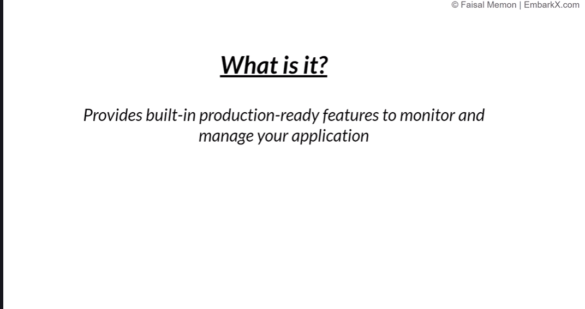
2) 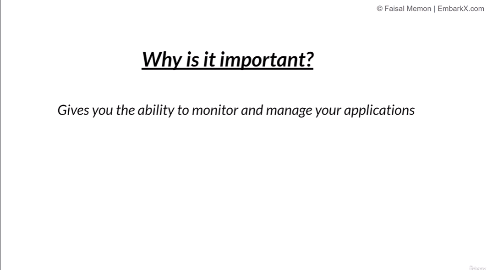
3) 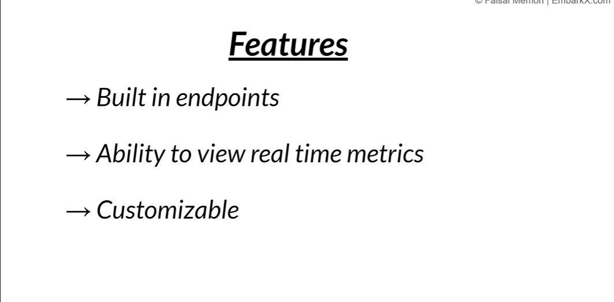
4) 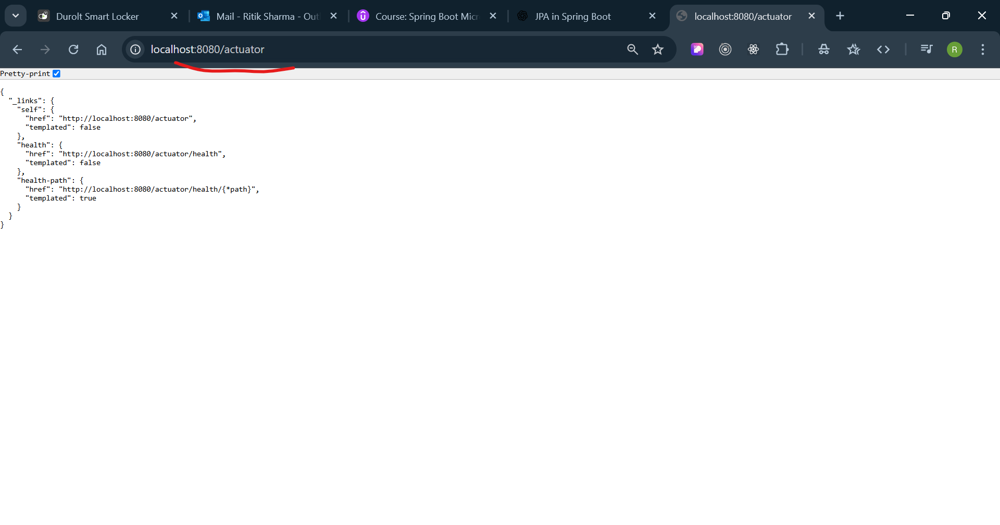
5) 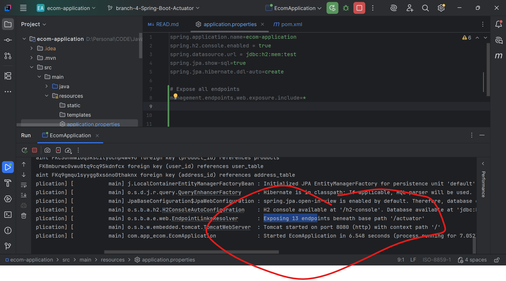
6) 
7) 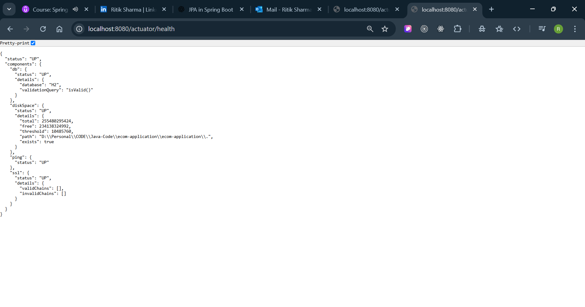

# -- some details about info Actuator Endpoints ---
Perfect 👍 Let’s dive deeper into the **`/actuator/info` endpoint** in Spring Boot Actuator.

---

# 📘 Spring Boot Actuator – `info` Endpoint

## 1. 🔎 What is the `info` Endpoint?

The **`/actuator/info`** endpoint is used to **expose custom application information** such as:

* Application name
* Version
* Description
* Build details (from Maven/Gradle)
* Any custom metadata you want

👉 It’s mainly for **application metadata**, not runtime metrics.

---

## 2. ⚙️ Enabling the `info` Endpoint

By default, the `info` endpoint is **disabled**. You must explicitly enable it:

```properties
management.endpoints.web.exposure.include=info
```

Then access it at:
👉 `http://localhost:8080/actuator/info`

---

## 3. 🧾 Adding Custom Info Properties

You can add app details inside `application.properties` or `application.yml`:

```properties
info.app.name=E-Commerce App
info.app.description=Spring Boot Actuator Info Example
info.app.version=1.0.0
info.developer.name=Ritik Sharma
info.developer.email=ritik@example.com
```

👉 Response:

```json
{
  "app": {
    "name": "E-Commerce App",
    "description": "Spring Boot Actuator Info Example",
    "version": "1.0.0"
  },
  "developer": {
    "name": "Ritik Sharma",
    "email": "ritik@example.com"
  }
}
```

---

## 4. 🛠️ Auto-Populate Info from Build (Maven/Gradle)

You can configure Spring Boot to read project details from `pom.xml` or `build.gradle`.

### Maven (`pom.xml`)

```xml
<build>
    <plugins>
        <plugin>
            <groupId>org.springframework.boot</groupId>
            <artifactId>spring-boot-maven-plugin</artifactId>
            <configuration>
                <addBuildInfo>true</addBuildInfo>
            </configuration>
        </plugin>
    </plugins>
</build>
```

👉 Generates `META-INF/build-info.properties` file.

Then `/actuator/info` shows:

```json
{
  "build": {
    "artifact": "ecom-application",
    "group": "com.app_ecom",
    "name": "E-Commerce App",
    "time": "2025-09-22T12:30:15Z",
    "version": "1.0.0"
  }
}
```

---

## 5. ✍️ Adding Custom Info via Java Code

You can programmatically add details with `InfoContributor`:

```java
import org.springframework.boot.actuate.info.Info;
import org.springframework.boot.actuate.info.InfoContributor;
import org.springframework.stereotype.Component;

import java.util.Map;

@Component
public class CustomInfoContributor implements InfoContributor {
    @Override
    public void contribute(Info.Builder builder) {
        builder.withDetail("project",
                Map.of("name", "E-Commerce System",
                       "team", "Backend Team",
                       "contact", "ritik@example.com"));
    }
}
```

👉 Response:

```json
{
  "project": {
    "name": "E-Commerce System",
    "team": "Backend Team",
    "contact": "ritik@example.com"
  }
}
```

---

## 6. 🔐 Securing the `info` Endpoint

* By default, `/actuator/info` is **public**.
* If you add **Spring Security**, you can protect it:

```properties
management.endpoints.web.exposure.include=info,health
management.endpoint.info.enabled=true
```

Then apply role-based access control in your security config.

---

## 7. 📌 Summary

* **`/actuator/info`** is for **application metadata**, not metrics.
* Can be populated via:

    * `application.properties` (`info.*`)
    * `build-info` (Maven/Gradle)
    * `InfoContributor` beans (Java code)
* Commonly used for:

    * Showing app name, version, build date.
    * Adding developer/team contact info.
    * Exposing environment (non-sensitive) configs.

---

⚡ Ritik, since you’re building an **e-commerce application**, you could expose info like:

* App version
* API base URL
* Payment gateway mode (sandbox/live)
* Support contact

👉 Want me to prepare an **example `info` response for your e-commerce app** (with version, developer, payment mode, etc.) that you can plug directly into your project?
1) 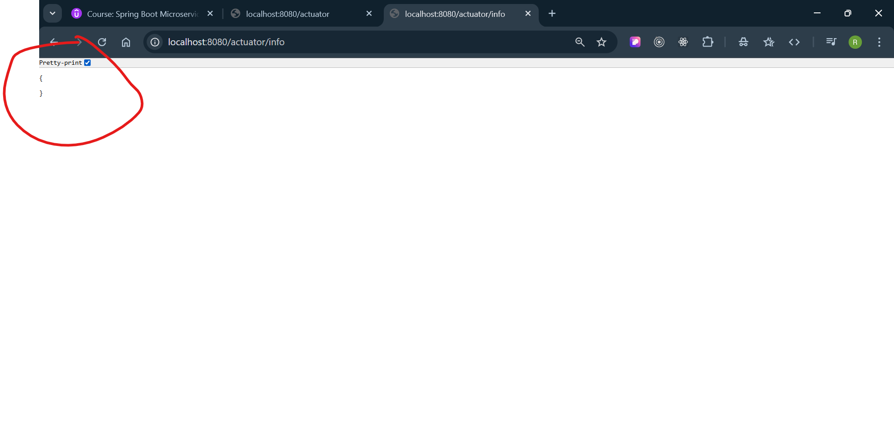

Got it 👍 thanks for sharing your config.
If `/actuator/info` is still returning `{}`, even with `info.*` properties set, then the issue is usually **how Actuator merges `info.*` properties into the InfoContributor chain**.

Here’s a checklist to fix it:

---

### ✅ 1. Check Spring Boot version

* In **Spring Boot 2.x**, `info.*` properties are automatically included.
* In **Spring Boot 3.x**, sometimes they need explicit enabling.

👉 Add this to your `application.properties`:

```properties
management.info.env.enabled=true
```

This tells Spring Boot to expose environment-based `info.*` properties.

---

### ✅ 2. Full working example

Try this exact `application.properties`:

```properties
spring.application.name=ecom-application
spring.h2.console.enabled=true
spring.datasource.url=jdbc:h2:mem:test
spring.jpa.show-sql=true
spring.jpa.hibernate.ddl-auto=create

# Expose all actuator endpoints
management.endpoints.web.exposure.include=*

# Show full health details
management.endpoint.health.show-details=always

# Enable info from environment
management.info.env.enabled=true

# Info endpoint data
info.app.name=E-Commerce App
info.app.description=Spring Boot Actuator Info Example
info.app.version=1.0.0
info.developer.name=Ritik Sharma
info.developer.email=ritik@example.com
```

---

### ✅ 3. Restart and test

After restart, hitting:

```
http://localhost:8080/actuator/info
```

should return:

```json
{
  "app": {
    "name": "E-Commerce App",
    "description": "Spring Boot Actuator Info Example",
    "version": "1.0.0"
  },
  "developer": {
    "name": "Ritik Sharma",
    "email": "ritik@example.com"
  }
}
```

---

### ✅ 4. Debugging tips

If still `{}`:

* Hit: `http://localhost:8080/actuator` → check if `info` is listed.
* If not listed, then the endpoint is not being exposed → check for `management.endpoints.web.exposure.include=*`.
* If it is listed but empty → it means `info.*` is not being picked → `management.info.env.enabled=true` is the key.

---

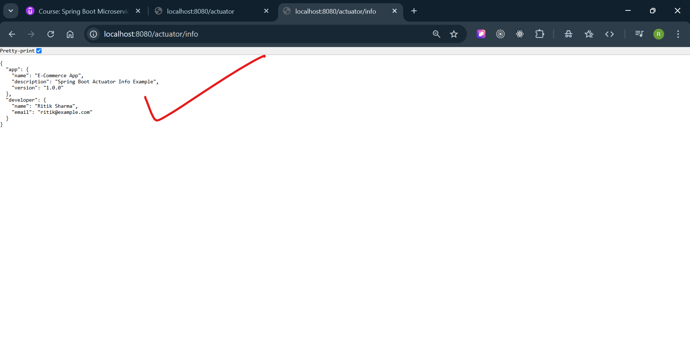

# --- Spring Boot Actuator – metrics Endpoint -----
Got it 👍 Let’s go step by step. Here are full **notes on the Spring Boot Actuator Matrix Endpoint**:

---

# 📊 Spring Boot Actuator – `metrics` Endpoint

### 🔹 What is the `metrics` Endpoint?

* The `metrics` endpoint in Spring Boot Actuator provides **insights into application metrics**.
* It exposes **system-level** (JVM, CPU, memory) and **application-level** (HTTP requests, datasource, cache, custom counters) metrics.
* Used for **monitoring, alerting, and performance tuning**.
* Works well with **Prometheus, Grafana, Micrometer, Datadog, New Relic**, etc.

---

### 🔹 How to Enable?

Add **Actuator dependency** in `pom.xml`:

```xml
<dependency>
    <groupId>org.springframework.boot</groupId>
    <artifactId>spring-boot-starter-actuator</artifactId>
</dependency>
```

Expose the endpoint in `application.properties`:

```properties
management.endpoints.web.exposure.include=metrics
```

Or expose all:

```properties
management.endpoints.web.exposure.include=*
```

---

### 🔹 How to Access?

Default URL:

```
http://localhost:8080/actuator/metrics
```

This returns a list of all available metrics, e.g.:

```json
{
  "names": [
    "jvm.memory.used",
    "jvm.memory.max",
    "jvm.threads.live",
    "system.cpu.usage",
    "http.server.requests",
    "jdbc.connections.active"
  ]
}
```

---

### 🔹 Drill Down into a Metric

You can request details about a specific metric, e.g.:

```
http://localhost:8080/actuator/metrics/jvm.memory.used
```

Response:

```json
{
  "name": "jvm.memory.used",
  "description": "The amount of used memory",
  "baseUnit": "bytes",
  "measurements": [
    {
      "statistic": "VALUE",
      "value": 52428800
    }
  ],
  "availableTags": [
    {
      "tag": "area",
      "values": ["heap", "nonheap"]
    },
    {
      "tag": "id",
      "values": ["PS Eden Space", "PS Survivor Space", "Compressed Class Space"]
    }
  ]
}
```

👉 Here, you can filter by tags like `heap` or `nonheap`.

---

### 🔹 Common Metrics

1. **JVM Metrics**

    * `jvm.memory.used` → memory used
    * `jvm.memory.max` → max heap
    * `jvm.threads.live` → live threads
    * `jvm.classes.loaded` → loaded classes

2. **System Metrics**

    * `system.cpu.usage` → CPU usage
    * `system.load.average.1m` → system load
    * `process.uptime` → uptime of JVM

3. **HTTP Request Metrics**

    * `http.server.requests` → request count, status, response time

4. **Datasource Metrics**

    * `jdbc.connections.active` → active DB connections
    * `jdbc.connections.max` → max DB connections

5. **Custom Metrics**

    * You can define your own counters and timers with **Micrometer**.

---

### 🔹 Adding Custom Metrics (Micrometer Example)

```java
import io.micrometer.core.instrument.MeterRegistry;
import org.springframework.stereotype.Component;

@Component
public class OrderMetrics {

    public OrderMetrics(MeterRegistry meterRegistry) {
        meterRegistry.counter("orders.created").increment();
        meterRegistry.gauge("orders.pending", 5);
    }
}
```

Now you’ll see these under:

```
http://localhost:8080/actuator/metrics/orders.created
```

---

### 🔹 Why is it Useful?

* Helps monitor **health and performance** of your app.
* Detect **memory leaks**, **high CPU usage**, or **slow HTTP endpoints**.
* Easy integration with **monitoring dashboards**.

---

✅ **Summary:**

* `metrics` is a **powerful actuator endpoint** for JVM, system, and app-level monitoring.
* Supports **tags, filters, and drill-downs**.
* Works with **Micrometer** for custom metrics.
* Integrates with **Prometheus, Grafana, etc.** for production monitoring.

---

👉 Do you want me to also show you how to **connect metrics with Prometheus + Grafana dashboard** so you can visualize JVM/HTTP performance in real time?
1) 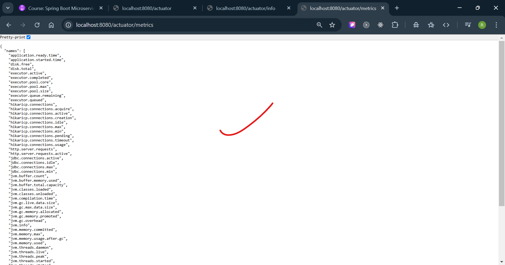
2) 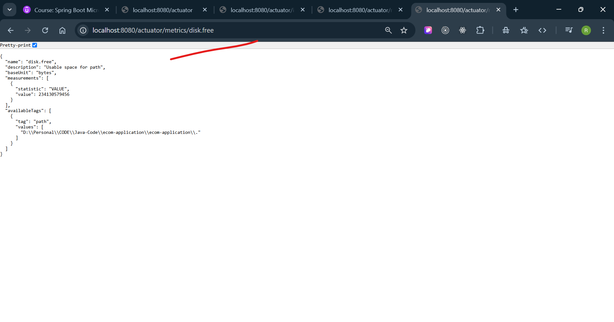

## ------- Spring Boot Actuator – loggers Endpoint --
Here’s a complete set of **notes on the `loggers` endpoint in Spring Boot Actuator** 👇

---

# 📘 Spring Boot Actuator – `loggers` Endpoint

### 🔹 What is the `loggers` Endpoint?

* The `loggers` endpoint in Spring Boot Actuator lets you **view and configure log levels at runtime**.
* You can **inspect** the logging levels of individual loggers (classes/packages) and also **change log levels dynamically** without restarting the application.
* Useful for debugging production issues quickly.

---

### 🔹 How to Enable?

Add Actuator dependency:

```xml
<dependency>
    <groupId>org.springframework.boot</groupId>
    <artifactId>spring-boot-starter-actuator</artifactId>
</dependency>
```

Expose the endpoint in `application.properties`:

```properties
management.endpoints.web.exposure.include=loggers
```

Or expose all:

```properties
management.endpoints.web.exposure.include=*
```

---

### 🔹 Accessing the Endpoint

Base URL:

```
http://localhost:8080/actuator/loggers
```

👉 This returns all the loggers and their current logging levels.

Example response:

```json
{
  "levels": ["OFF", "ERROR", "WARN", "INFO", "DEBUG", "TRACE"],
  "loggers": {
    "root": {
      "configuredLevel": "INFO",
      "effectiveLevel": "INFO"
    },
    "org.springframework.web": {
      "configuredLevel": null,
      "effectiveLevel": "INFO"
    },
    "com.app_ecom": {
      "configuredLevel": "DEBUG",
      "effectiveLevel": "DEBUG"
    }
  }
}
```

---

### 🔹 Get a Specific Logger

```
http://localhost:8080/actuator/loggers/com.app_ecom
```

Example response:

```json
{
  "configuredLevel": "DEBUG",
  "effectiveLevel": "DEBUG"
}
```

---

### 🔹 Change Log Level at Runtime

You can update log level using a `POST` request.

Example:

```bash
curl -X POST "http://localhost:8080/actuator/loggers/com.app_ecom" \
     -H "Content-Type: application/json" \
     -d '{"configuredLevel": "TRACE"}'
```

After this, `com.app_ecom` logger will print **TRACE** logs without restarting the app.

✅ Supported Levels:

* `OFF`, `ERROR`, `WARN`, `INFO`, `DEBUG`, `TRACE`

---

### 🔹 Why Use `loggers`?

* Dynamically increase logging for troubleshooting in **production**.
* Avoid redeploying apps just to change `application.properties`.
* Monitor which loggers are **active** and their effective log levels.

---

### 🔹 Best Practices

1. Keep the root logger at `INFO` or `WARN` in production.
2. Use `DEBUG`/`TRACE` only temporarily for debugging.
3. Automate log-level changes with monitoring tools (e.g., **Spring Boot Admin**, Prometheus alerts).

---

✅ **Summary:**

* The `loggers` endpoint in Spring Boot Actuator gives visibility into **current log levels**.
* You can **view** and **change log levels dynamically** using simple REST calls.
* Very useful for debugging without restarting the app.

---

Would you like me to also show you how to **bind loggers with Spring Boot Admin** so you can change log levels directly from a web UI instead of using `curl` or Postman?
1) 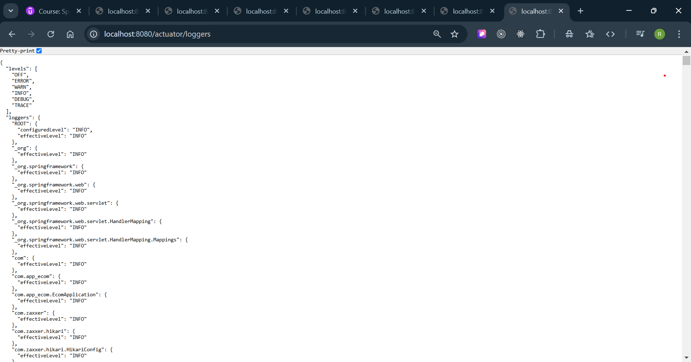

Got it 👍 Here are **detailed notes on the `beans` and `shutdown` Actuator endpoints** in Spring Boot:

---

# 📘 Spring Boot Actuator – `beans` Endpoint

### 🔹 What is the `beans` Endpoint?

* The `beans` endpoint provides a **complete list of all Spring beans** loaded in the ApplicationContext.
* It helps in debugging and understanding the **dependency graph** of your Spring Boot application.

---

### 🔹 How to Enable?

In `application.properties`:

```properties
management.endpoints.web.exposure.include=beans
```

---

### 🔹 Accessing the Endpoint

```
http://localhost:8080/actuator/beans
```

Example response:

```json
{
  "contexts": {
    "application": {
      "beans": {
        "orderController": {
          "aliases": [],
          "scope": "singleton",
          "type": "com.app_ecom.controller.OrderController",
          "resource": "file [/src/main/java/com/app_ecom/controller/OrderController.class]",
          "dependencies": ["orderService"]
        },
        "orderService": {
          "aliases": [],
          "scope": "singleton",
          "type": "com.app_ecom.service.OrderService",
          "resource": "file [/src/main/java/com/app_ecom/service/OrderService.class]",
          "dependencies": ["orderRepository", "userRepository", "cartService"]
        }
      }
    }
  }
}
```

---

### 🔹 Why Useful?

* Debugging **circular dependencies**.
* Checking which beans Spring created.
* Inspecting bean scopes (`singleton`, `prototype`, etc.).
* Understanding how beans are wired together.

---

# 📘 Spring Boot Actuator – `shutdown` Endpoint

### 🔹 What is the `shutdown` Endpoint?

* The `shutdown` endpoint allows you to **gracefully stop** a running Spring Boot application via an HTTP call.
* Disabled by default (for **security reasons**).

---

### 🔹 How to Enable?

In `application.properties`:

```properties
management.endpoints.web.exposure.include=shutdown
management.endpoint.shutdown.enabled=true
```

---

### 🔹 Accessing the Endpoint

Send a `POST` request:

```bash
curl -X POST "http://localhost:8080/actuator/shutdown"
```

Example response:

```json
{
  "message": "Shutting down, bye..."
}
```

---

### 🔹 Why Useful?

* To **gracefully stop** applications running in production.
* Useful in **cloud environments** or **containerized deployments** where an API-based shutdown is needed.

---

### 🔹 Best Practices

* Always keep this endpoint **disabled in production**, unless you secure it with authentication (e.g., Spring Security).
* Instead, prefer **orchestration tools** (Kubernetes, Docker, etc.) for managing shutdowns.

---

# ✅ Summary

* **`beans` Endpoint**: Lists all beans, their types, scopes, and dependencies → great for debugging and understanding app context.
* **`shutdown` Endpoint**: Allows graceful shutdown via HTTP `POST`, but should be used carefully and secured.

---

Would you like me to also prepare a **comparison table of all common Actuator endpoints** (health, metrics, info, beans, loggers, shutdown, etc.) so you have a one-page reference?

Perfect 👍 Here’s a **comparison table of the most commonly used Spring Boot Actuator Endpoints** for a quick one-page reference:

---

# 📘 Spring Boot Actuator – Endpoint Reference Table

| **Endpoint**    | **Path**                | **Enabled By Default**  | **Description / Use Case**                                                                                              |
| --------------- | ----------------------- | ----------------------- | ----------------------------------------------------------------------------------------------------------------------- |
| **health**      | `/actuator/health`      | ✅ Yes                   | Shows application health status (UP/DOWN). Can show details of DB, disk space, etc.                                     |
| **info**        | `/actuator/info`        | ✅ Yes                   | Displays application metadata (name, version, description, developer info, etc.). Configurable via `info.*` properties. |
| **metrics**     | `/actuator/metrics`     | ✅ Yes                   | Provides performance metrics (JVM memory, CPU, HTTP requests, GC, etc.).                                                |
| **loggers**     | `/actuator/loggers`     | ✅ Yes                   | Shows and modifies application log levels at runtime.                                                                   |
| **beans**       | `/actuator/beans`       | ✅ Yes                   | Lists all Spring beans, their scopes, and dependencies. Useful for debugging.                                           |
| **env**         | `/actuator/env`         | ✅ Yes                   | Displays environment properties (system properties, application properties, profiles).                                  |
| **mappings**    | `/actuator/mappings`    | ✅ Yes                   | Shows all @RequestMapping paths and their handler methods.                                                              |
| **threaddump**  | `/actuator/threaddump`  | ✅ Yes                   | Returns a thread dump of the JVM for debugging deadlocks or performance issues.                                         |
| **heapdump**    | `/actuator/heapdump`    | ❌ No (needs dependency) | Generates a JVM heap dump file. Useful for memory leak analysis.                                                        |
| **shutdown**    | `/actuator/shutdown`    | ❌ No (must be enabled)  | Gracefully shuts down the application. Disabled by default for security reasons.                                        |
| **conditions**  | `/actuator/conditions`  | ✅ Yes                   | Shows auto-configuration report (which configs matched or not). Helpful for debugging Spring Boot auto-config.          |
| **caches**      | `/actuator/caches`      | ✅ Yes                   | Shows available caches and cache stats.                                                                                 |
| **auditevents** | `/actuator/auditevents` | ❌ No (needs setup)      | Shows application audit events (like logins, auth failures).                                                            |

---

# 📘 Configuration Tips

To expose all endpoints in `application.properties`:

```properties
management.endpoints.web.exposure.include=*
```

To expose only specific endpoints:

```properties
management.endpoints.web.exposure.include=health,info,metrics,beans,loggers
```

---

# ✅ Summary

* **Developers** → Use `beans`, `mappings`, `conditions`, `env` for debugging.
* **Ops/Monitoring** → Use `health`, `metrics`, `loggers`, `threaddump`.
* **Special cases** → `heapdump` (memory leaks), `shutdown` (controlled shutdown, but risky in prod).

---

👉 Do you want me to also create a **diagram/flow chart** showing how these endpoints are grouped (monitoring, debugging, operational)? That would make it more visual.

Great ✅ Here’s a **visual grouping (diagram-style explanation)** of Spring Boot Actuator Endpoints:

---

# 📘 Spring Boot Actuator Endpoint Groups

```
                        ┌────────────────────────────┐
                        │   Spring Boot Actuator     │
                        └───────────────┬────────────┘
                                        │
        ┌───────────────────────────────┼───────────────────────────────┐
        │                               │                               │
 Monitoring Endpoints           Debugging Endpoints             Operational Endpoints
 (Health & Metrics)             (App Internals)                 (Admin / Control)
        │                               │                               │
 ┌──────┴──────┐              ┌─────────┴─────────┐            ┌────────┴────────┐
 │ /health     │              │ /beans            │            │ /shutdown        │
 │ /info       │              │ /mappings         │            │ /heapdump        │
 │ /metrics    │              │ /env              │            │ /threaddump      │
 │ /loggers    │              │ /conditions       │            │ /auditevents     │
 │ /caches     │              │                   │            │                  │
 └─────────────┘              └───────────────────┘            └──────────────────┘
```

---

# 📘 Explanation of Groups

### 🔹 **Monitoring Endpoints**

Used by **DevOps / Monitoring tools** to check app health & performance.

* `/health` → UP/DOWN status
* `/info` → Metadata (version, developer info, etc.)
* `/metrics` → JVM, HTTP, DB, CPU metrics
* `/loggers` → Logging levels
* `/caches` → Cache stats

---

### 🔹 **Debugging Endpoints**

Helps **developers** to see what’s happening inside Spring.

* `/beans` → Loaded beans, scopes, dependencies
* `/mappings` → All REST mappings & handlers
* `/env` → Environment properties (system + app configs)
* `/conditions` → Auto-config report (why something was loaded or not)

---

### 🔹 **Operational Endpoints**

Used for **troubleshooting or controlling app** (careful in prod 🚨).

* `/shutdown` → Gracefully stop the app (must be enabled)
* `/heapdump` → Get heap dump for memory analysis
* `/threaddump` → Get JVM thread dump for debugging deadlocks
* `/auditevents` → Security/audit events

---

✅ This grouping helps you remember **what to use when**:

* Monitoring → Production safe
* Debugging → Developer tools
* Operational → Restricted / Admin only

---

👉 Do you want me to also create a **real-world example** (like monitoring an e-commerce app with `/health`, debugging with `/mappings`, shutting down with `/shutdown`)? That way you’ll see exactly how each group fits in practice.
