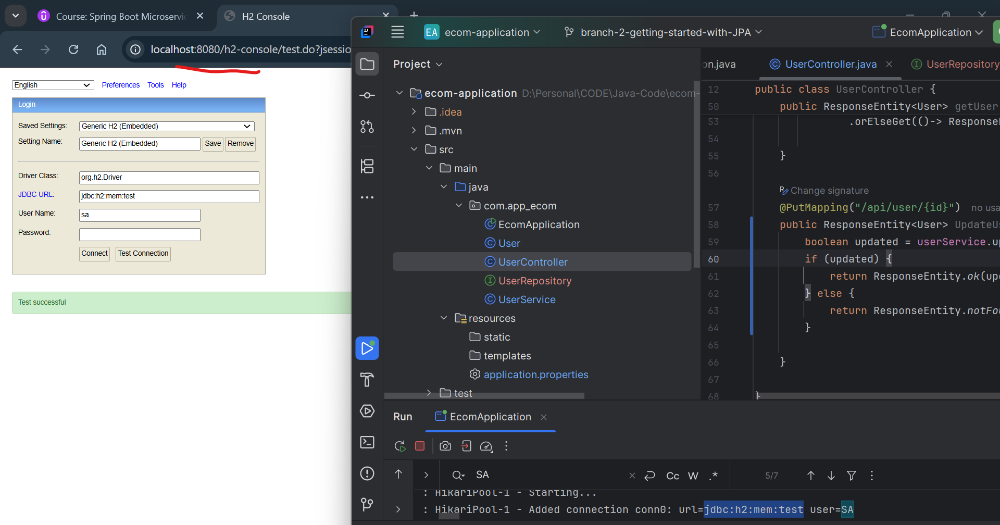
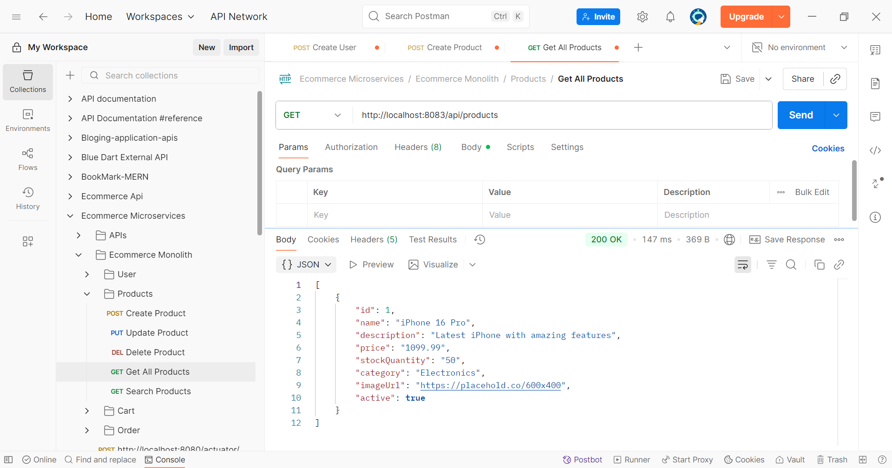
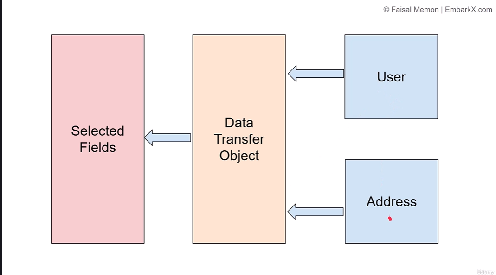
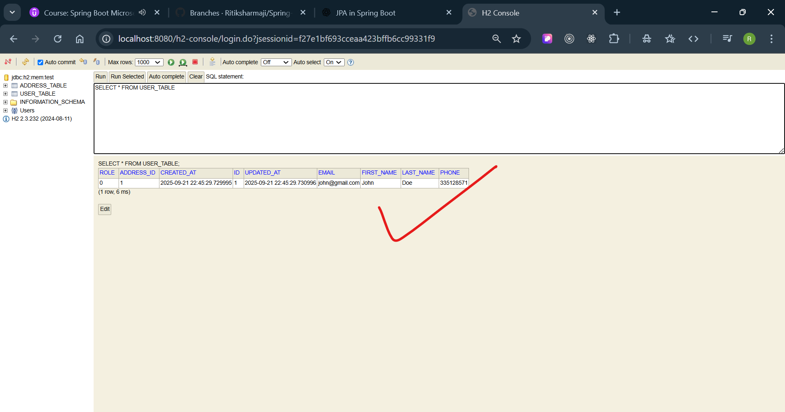
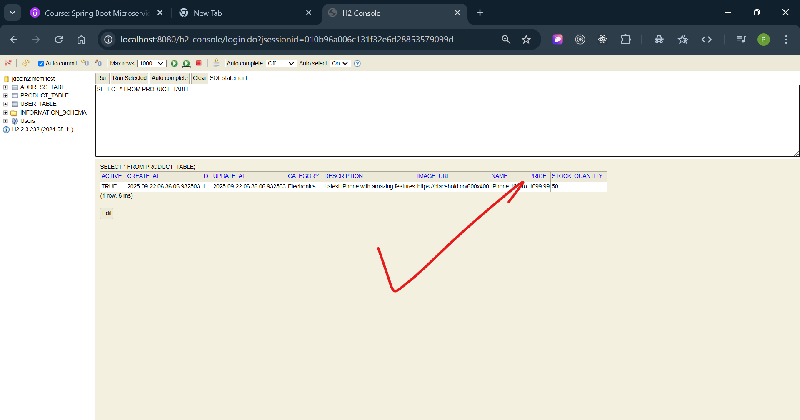
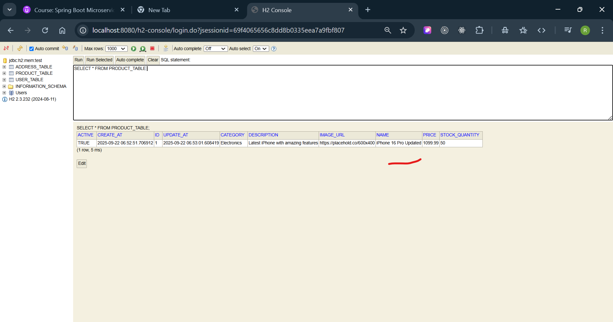
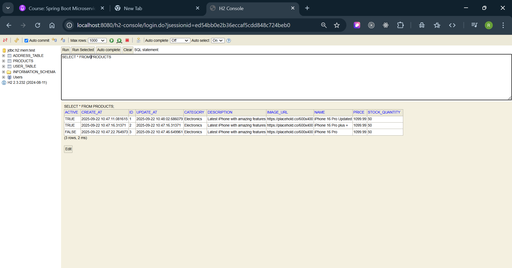
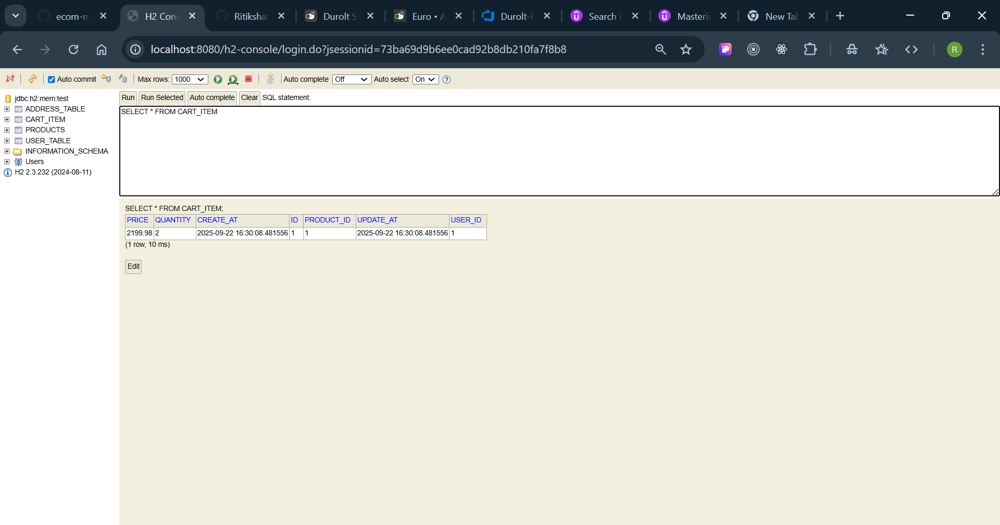
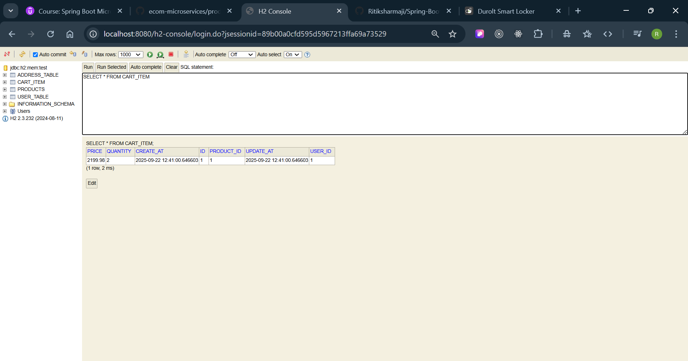

# -- gives notes about JPA in Spring boot --
Got it 👍 Here are well-structured notes about **JPA (Java Persistence API) in Spring Boot** that you can use for study or projects:

---

# 📌 JPA in Spring Boot – Notes

## 1. What is JPA?

* **JPA (Java Persistence API)** is a specification for object-relational mapping (ORM) in Java.
* It provides a way to map Java objects (entities) to relational database tables.
* **Hibernate** is the most commonly used JPA implementation in Spring Boot.

---

## 2. Why Use JPA in Spring Boot?

* Eliminates boilerplate JDBC code.
* Provides CRUD operations with less effort.
* Supports relationships between tables using annotations.
* Allows switching databases easily (only change configuration).
* Works seamlessly with **Spring Data JPA** to reduce repository code.

---

## 3. Important JPA Annotations

### Entity Mapping

* `@Entity` → Marks a class as a JPA entity (table).
* `@Table(name = "table_name")` → Defines table name.

### Column Mapping

* `@Id` → Marks the primary key.
* `@GeneratedValue(strategy = …)` → Auto-generate IDs (IDENTITY, AUTO, SEQUENCE).
* `@Column(name = "column_name")` → Maps Java field to a database column.

### Relationships

* `@OneToOne`
* `@OneToMany`
* `@ManyToOne`
* `@ManyToMany`
* `@JoinColumn` → Defines foreign key.

### Other

* `@Transient` → Field not persisted.
* `@Embedded` / `@Embeddable` → For composite objects.

---

## 4. Spring Data JPA

Spring Boot provides **Spring Data JPA** for simplifying JPA usage.

* **Repository Interfaces**:

    * `CrudRepository<T, ID>` → Basic CRUD
    * `JpaRepository<T, ID>` → Full JPA + pagination + sorting

Example:

```java
public interface UserRepository extends JpaRepository<User, Long> {
    List<User> findByName(String name);
    List<User> findByAgeGreaterThan(int age);
}
```

---

## 5. Application Properties

In `application.properties` or `application.yml`:

```properties
spring.datasource.url=jdbc:mysql://localhost:3306/testdb
spring.datasource.username=root
spring.datasource.password=root
spring.jpa.hibernate.ddl-auto=update
spring.jpa.show-sql=true
spring.jpa.properties.hibernate.dialect=org.hibernate.dialect.MySQL8Dialect
```

* `ddl-auto` values:

    * `create` → Creates tables every time.
    * `update` → Updates schema automatically (recommended in dev).
    * `validate` → Validates schema without making changes.
    * `none` → No action.

---

## 6. Example Entity

```java
@Entity
@Table(name = "users")
public class User {
    @Id
    @GeneratedValue(strategy = GenerationType.IDENTITY)
    private Long id;

    @Column(nullable=false, length=100)
    private String name;

    private int age;

    // Getters and Setters
}
```

---

## 7. Example Repository

```java
@Repository
public interface UserRepository extends JpaRepository<User, Long> {
    List<User> findByName(String name);
}
```

---

## 8. Example Service

```java
@Service
public class UserService {
    @Autowired
    private UserRepository userRepository;

    public List<User> getAllUsers() {
        return userRepository.findAll();
    }

    public User saveUser(User user) {
        return userRepository.save(user);
    }
}
```

---

## 9. Example Controller

```java
@RestController
@RequestMapping("/users")
public class UserController {
    @Autowired
    private UserService userService;

    @GetMapping
    public List<User> getUsers() {
        return userService.getAllUsers();
    }

    @PostMapping
    public User createUser(@RequestBody User user) {
        return userService.saveUser(user);
    }
}
```

---

## 10. Advantages of JPA in Spring Boot

* Reduces boilerplate code.
* Supports query methods (`findBy…`).
* Provides **JPQL** (object-based queries).
* Works with **native SQL queries** if needed.
* Integrated with **Spring Boot autoconfiguration**.

---

⚡ Pro Tip: For real projects, prefer `spring.jpa.hibernate.ddl-auto=validate` in production (to avoid accidental schema changes).

---

## --------------- 

1) traslater between database code to java code
2) 

## ------- give example of CURD operation using JPA ---
Perfect 👍 Let’s go step by step with a **CRUD (Create, Read, Update, Delete) example using JPA in Spring Boot**.

We’ll use a simple `User` entity as an example.

---

# 📌 CRUD Example with Spring Boot + JPA

## 1. Entity Class

```java
import jakarta.persistence.*;

@Entity
@Table(name = "users")
public class User {
    @Id
    @GeneratedValue(strategy = GenerationType.IDENTITY)
    private Long id;

    @Column(nullable = false, length = 100)
    private String name;

    private int age;

    // Getters & Setters
    public Long getId() { return id; }
    public void setId(Long id) { this.id = id; }

    public String getName() { return name; }
    public void setName(String name) { this.name = name; }

    public int getAge() { return age; }
    public void setAge(int age) { this.age = age; }
}
```

---

## 2. Repository Interface

```java
import org.springframework.data.jpa.repository.JpaRepository;
import org.springframework.stereotype.Repository;

@Repository
public interface UserRepository extends JpaRepository<User, Long> {
    // Spring Data JPA provides default CRUD methods
    // Additional custom queries can be added here if needed
}
```

---

## 3. Service Layer

```java
import org.springframework.beans.factory.annotation.Autowired;
import org.springframework.stereotype.Service;
import java.util.List;
import java.util.Optional;

@Service
public class UserService {
    @Autowired
    private UserRepository userRepository;

    // Create
    public User createUser(User user) {
        return userRepository.save(user);
    }

    // Read (all users)
    public List<User> getAllUsers() {
        return userRepository.findAll();
    }

    // Read (by ID)
    public Optional<User> getUserById(Long id) {
        return userRepository.findById(id);
    }

    // Update
    public User updateUser(Long id, User newUserData) {
        return userRepository.findById(id).map(user -> {
            user.setName(newUserData.getName());
            user.setAge(newUserData.getAge());
            return userRepository.save(user);
        }).orElseThrow(() -> new RuntimeException("User not found"));
    }

    // Delete
    public void deleteUser(Long id) {
        userRepository.deleteById(id);
    }
}
```

---

## 4. Controller Layer

```java
import org.springframework.beans.factory.annotation.Autowired;
import org.springframework.web.bind.annotation.*;
import java.util.List;

@RestController
@RequestMapping("/users")
public class UserController {
    @Autowired
    private UserService userService;

    // Create
    @PostMapping
    public User createUser(@RequestBody User user) {
        return userService.createUser(user);
    }

    // Read all
    @GetMapping
    public List<User> getUsers() {
        return userService.getAllUsers();
    }

    // Read by ID
    @GetMapping("/{id}")
    public User getUserById(@PathVariable Long id) {
        return userService.getUserById(id).orElseThrow(() -> new RuntimeException("User not found"));
    }

    // Update
    @PutMapping("/{id}")
    public User updateUser(@PathVariable Long id, @RequestBody User user) {
        return userService.updateUser(id, user);
    }

    // Delete
    @DeleteMapping("/{id}")
    public String deleteUser(@PathVariable Long id) {
        userService.deleteUser(id);
        return "User deleted successfully!";
    }
}
```

---

## 5. Application Properties (example with MySQL)

```properties
spring.datasource.url=jdbc:mysql://localhost:3306/testdb
spring.datasource.username=root
spring.datasource.password=root

spring.jpa.hibernate.ddl-auto=update
spring.jpa.show-sql=true
spring.jpa.properties.hibernate.dialect=org.hibernate.dialect.MySQL8Dialect
```

---

## 6. API Endpoints (CRUD)

* **Create User** → `POST /users`

  ```json
  { "name": "Ritik", "age": 23 }
  ```
* **Get All Users** → `GET /users`
* **Get User by ID** → `GET /users/1`
* **Update User** → `PUT /users/1`

  ```json
  { "name": "Ritik Sharma", "age": 24 }
  ```
* **Delete User** → `DELETE /users/1`

---

⚡ That’s a complete CRUD setup with JPA in Spring Boot.

Do you want me to also show you **how to write custom JPQL and Native SQL queries** in this example (like `findByName`, `findByAgeGreaterThan`)?

## ------- what is H2 database notes with exmaples ------
Got it 👍 Let’s make proper **notes about H2 Database** with examples so you can understand and revise easily.

---

# 📌 H2 Database Notes with Examples

## 1. What is H2 Database?

* **H2 Database** is an open-source, lightweight, fast **relational database** written in Java.
* Can run in:

    * **In-memory mode** (data stored in RAM, lost on restart)
    * **Embedded mode** (stored in local file, persists across restarts)
    * **Server mode** (can be accessed by multiple applications)
* Commonly used in **Spring Boot** for development & testing.

---

## 2. Why Use H2 Database?

✅ Very fast & lightweight
✅ No external setup required
✅ Integrated console for SQL queries
✅ Good for prototyping & unit testing
✅ Supports standard **JDBC, JPA, Hibernate**

---

## 3. H2 Database Modes

1. **In-memory Mode**

    * Data stored only in RAM, lost when app stops.
    * Example JDBC URL:

      ```
      jdbc:h2:mem:testdb
      ```

2. **File-based Mode**

    * Data stored in a local file.
    * Example JDBC URL:

      ```
      jdbc:h2:file:./data/testdb
      ```

3. **Server Mode**

    * Works like a standalone database server.
    * Example JDBC URL:

      ```
      jdbc:h2:tcp://localhost/~/test
      ```

---

## 4. H2 in Spring Boot – Setup

### Add Dependency (`pom.xml`)

```xml
<dependency>
    <groupId>com.h2database</groupId>
    <artifactId>h2</artifactId>
    <scope>runtime</scope>
</dependency>
```

### Configure `application.properties`

```properties
# H2 Database Config
spring.datasource.url=jdbc:h2:mem:testdb
spring.datasource.driverClassName=org.h2.Driver
spring.datasource.username=sa
spring.datasource.password=

# JPA Config
spring.jpa.database-platform=org.hibernate.dialect.H2Dialect
spring.jpa.hibernate.ddl-auto=update
spring.jpa.show-sql=true

# Enable H2 Console
spring.h2.console.enabled=true
spring.h2.console.path=/h2-console
```

👉 Access console at: `http://localhost:8080/h2-console`

---

## 5. Example Entity

```java
import jakarta.persistence.*;

@Entity
@Table(name = "users")
public class User {
    @Id
    @GeneratedValue(strategy = GenerationType.IDENTITY)
    private Long id;

    private String name;
    private int age;

    // Getters & Setters
}
```

---

## 6. Example Repository

```java
import org.springframework.data.jpa.repository.JpaRepository;

public interface UserRepository extends JpaRepository<User, Long> {
    User findByName(String name);
}
```

---

## 7. Example Controller

```java
import org.springframework.web.bind.annotation.*;
import java.util.List;

@RestController
@RequestMapping("/users")
public class UserController {
    private final UserRepository userRepository;

    public UserController(UserRepository userRepository) {
        this.userRepository = userRepository;
    }

    // Create User
    @PostMapping
    public User create(@RequestBody User user) {
        return userRepository.save(user);
    }

    // Read All Users
    @GetMapping
    public List<User> getAll() {
        return userRepository.findAll();
    }
}
```

---

## 8. Example API Calls

1. **Create User** → `POST /users`

   ```json
   { "name": "Ritik", "age": 23 }
   ```
2. **Read Users** → `GET /users`

   ```json
   [
     { "id": 1, "name": "Ritik", "age": 23 }
   ]
   ```

---

## 9. Preloading Data in H2

You can create a `data.sql` file inside `src/main/resources/`:

```sql
INSERT INTO users (id, name, age) VALUES (1, 'Ritik', 23);
INSERT INTO users (id, name, age) VALUES (2, 'Sharma', 25);
```

👉 This will load initial data when Spring Boot starts.

---

## 10. Advantages of H2 Database

* Easy to configure with Spring Boot.
* Supports SQL and JDBC.
* Provides browser-based **H2 Console**.
* No installation needed.
* Great for **unit testing** and **quick prototypes**.

---

✅ In summary:
H2 is mostly used in **Spring Boot projects for development/testing** because it’s **fast, lightweight, and requires no setup**.

---

Would you like me to also prepare a **comparison table: H2 vs MySQL vs PostgreSQL** so you can clearly see when to use H2?

## -------
1) 

## ----------- working with DTO(notes on DTO in spring boot) ----
Great question 👍 Let’s go step by step with **notes about DTO (Data Transfer Object) in Spring Boot**, with examples.

---

# 📌 DTO (Data Transfer Object) in Spring Boot

## 1. What is a DTO?

* A **DTO (Data Transfer Object)** is a plain Java object used to transfer data between different layers (Controller ↔ Service ↔ Client) without exposing the actual entity.
* It is often used to:

    * Hide internal database structure.
    * Prevent exposing sensitive fields.
    * Customize the response format.
    * Improve API performance (by sending only needed fields).

---

## 2. Why Use DTO?

✅ **Security** → Don’t expose entity with sensitive info (like password, roles).
✅ **Decoupling** → Changes in database schema don’t directly break API contract.
✅ **Performance** → Transfer only required fields instead of full entity.
✅ **Validation** → Can apply validation annotations (`@NotNull`, `@Email`, etc.) on DTO fields.
✅ **Readability** → Clear distinction between persistence layer (Entity) and API layer (DTO).

---

## 3. Example Without DTO (Bad Practice)

```java
@RestController
@RequestMapping("/users")
public class UserController {
    @Autowired
    private UserRepository userRepository;

    @GetMapping("/{id}")
    public User getUser(@PathVariable Long id) {
        return userRepository.findById(id).orElse(null);
    }
}
```

⚠️ Problem: This directly returns the **Entity**, which may include unwanted fields like `password`.

---

## 4. Example With DTO (Good Practice)

### Entity

```java
import jakarta.persistence.*;

@Entity
@Table(name = "users")
public class User {
    @Id
    @GeneratedValue(strategy = GenerationType.IDENTITY)
    private Long id;

    private String firstName;
    private String lastName;
    private String email;
    private String password; // sensitive field

    // getters & setters
}
```

### DTO

```java
public class UserDTO {
    private String firstName;
    private String lastName;
    private String email;

    // constructor
    public UserDTO(String firstName, String lastName, String email) {
        this.firstName = firstName;
        this.lastName = lastName;
        this.email = email;
    }

    // getters & setters
}
```

### Service (Entity → DTO Mapping)

```java
import org.springframework.stereotype.Service;
import java.util.List;
import java.util.stream.Collectors;

@Service
public class UserService {
    private final UserRepository userRepository;

    public UserService(UserRepository userRepository) {
        this.userRepository = userRepository;
    }

    public List<UserDTO> getAllUsers() {
        return userRepository.findAll()
                .stream()
                .map(user -> new UserDTO(
                        user.getFirstName(),
                        user.getLastName(),
                        user.getEmail()))
                .collect(Collectors.toList());
    }
}
```

### Controller

```java
import org.springframework.web.bind.annotation.*;
import java.util.List;

@RestController
@RequestMapping("/users")
public class UserController {
    private final UserService userService;

    public UserController(UserService userService) {
        this.userService = userService;
    }

    @GetMapping
    public List<UserDTO> getUsers() {
        return userService.getAllUsers();
    }
}
```

👉 Now, API will return only `firstName, lastName, email`, **hiding password**.

---

## 5. DTO Conversion Approaches

1. **Manual Mapping** (like above) → simple but verbose.
2. **ModelMapper Library**

    * Auto-maps entity ↔ DTO fields with same names.

   ```java
   ModelMapper modelMapper = new ModelMapper();
   UserDTO dto = modelMapper.map(user, UserDTO.class);
   ```
3. **MapStruct** (compile-time code generation, faster than ModelMapper).

---

## 6. Example Response With DTO

Request → `GET /users`
Response:

```json
[
  {
    "firstName": "Ritik",
    "lastName": "Sharma",
    "email": "ritik@example.com"
  }
]
```

✅ No password exposed!

---

## 7. Summary

* DTO = Data Transfer Object (used for API responses/requests).
* Avoids exposing JPA entities directly.
* Improves **security**, **performance**, and **API design**.
* Can use **manual mapping**, **ModelMapper**, or **MapStruct** for conversion.

---

2) 
2) 
3) 

## ------- working with product --
1) create model/product
2) create repository/ProductRepository
3) create controller/ProductController
4) create dto/ProductRequest
5) dto/ProductResponse
6) service/ProductService
7) 
8) not working on Update Product
9) 
## ----- working on getting products and product and searching product ----
1) 
# --- Working on card ------
1) create model/CartItem
2) create repository/CartItemRepository
3) create controller/CartItemController
4) 

