## ------------- PostgreSQL — Complete Notes --------
Perfect question Ritik 👍. Let’s break it down into a **complete set of notes** on **PostgreSQL**, especially in the context of **Spring Boot**.

---

# 🐘 PostgreSQL — Complete Notes

## 🔹 1. What is PostgreSQL?

* PostgreSQL (often called **Postgres**) is a **powerful, open-source, object-relational database system (ORDBMS)**.
* Known for **reliability, robustness, and performance**.
* Supports **SQL** (relational queries) and **JSON** (non-relational queries).
* Designed to handle **large-scale applications, complex queries, and high-concurrency workloads**.

👉 It is widely used in **enterprise applications, financial systems, e-commerce, analytics, and web apps**.

---

## 🔹 2. Use of PostgreSQL

* Store structured data (tables, rows, relationships).
* Handle **complex queries** with joins, indexing, triggers, and views.
* Store **semi-structured data** like JSON and XML.
* **Transaction management** (ACID compliance: Atomicity, Consistency, Isolation, Durability).
* **Geospatial data handling** with PostGIS extension.
* Used in **Spring Boot apps** for persistent data storage.

---

## 🔹 3. Advantages of PostgreSQL

✅ **Open Source & Free** – No license cost.
✅ **Cross-Platform** – Works on Linux, Windows, MacOS.
✅ **ACID compliant** – Ensures reliable transactions.
✅ **Extensibility** – Supports custom functions, types, operators.
✅ **Advanced Features**:

* JSON/JSONB storage (NoSQL-like support).
* Full-text search.
* Table partitioning.
* Stored procedures & triggers.
  ✅ **Strong community support** – Actively developed.
  ✅ **Scalability** – Handles huge datasets & high concurrency.
  ✅ **Security** – Role-based authentication, SSL connections.

---

## 🔹 4. Disadvantages of PostgreSQL

❌ **Performance tuning** can be complex (compared to MySQL).
❌ **Learning curve** is higher for beginners.
❌ Slightly **slower write performance** in some cases (because of strict ACID compliance).
❌ **Replication & clustering** setup is more complex than some databases.
❌ Can be **heavier on resources** for small-scale apps.

---

## 🔹 5. Where to Use PostgreSQL?

📌 **Best suited for:**

* Complex business applications.
* Financial/Banking systems (where data integrity is critical).
* Analytics & reporting systems.
* E-commerce apps (with product catalogs, user data, orders).
* Apps needing **JSON + SQL hybrid storage**.
* GIS/Mapping apps (PostGIS).

📌 **Not ideal for:**

* Very small apps (SQLite or MySQL may be lighter).
* Real-time apps needing super-high write speeds (NoSQL databases like MongoDB may be better).

---

## 🔹 6. Why Use PostgreSQL in Spring Boot?

Spring Boot integrates seamlessly with PostgreSQL using **Spring Data JPA / Hibernate**.

### Benefits in Spring Boot:

✅ Easy configuration using `application.properties` or `application.yml`.
✅ Works with JPA/Hibernate ORM for object-relational mapping.
✅ Strong support for JSONB → helps if app needs hybrid NoSQL+SQL.
✅ Production-ready with high scalability.
✅ Open-source & free → cost-effective for startups & enterprises.

---

## 🔹 7. Spring Boot + PostgreSQL Configuration

### Add Dependency (Maven)

```xml
<dependency>
    <groupId>org.springframework.boot</groupId>
    <artifactId>spring-boot-starter-data-jpa</artifactId>
</dependency>

<dependency>
    <groupId>org.postgresql</groupId>
    <artifactId>postgresql</artifactId>
    <scope>runtime</scope>
</dependency>
```

---

### Application Properties

```properties
spring.datasource.url=jdbc:postgresql://localhost:5432/ecomdb
spring.datasource.username=postgres
spring.datasource.password=admin
spring.jpa.hibernate.ddl-auto=update
spring.jpa.show-sql=true
spring.jpa.properties.hibernate.dialect=org.hibernate.dialect.PostgreSQLDialect
```

---

### Entity Example

```java
@Entity
public class Product {
    @Id
    @GeneratedValue(strategy = GenerationType.IDENTITY)
    private Long id;
    private String name;
    private BigDecimal price;
}
```

---

### Repository Example

```java
@Repository
public interface ProductRepository extends JpaRepository<Product, Long> {
}
```

---

## 🔹 8. Real-Life Use Cases in Spring Boot

* **E-Commerce Apps** → Store users, products, orders.
* **Banking Systems** → Transactions & account details.
* **Analytics Dashboards** → Handle complex queries.
* **Microservices** → Each service using Postgres as backend DB.

---

✅ **Summary:**
PostgreSQL is a **powerful, reliable, and scalable RDBMS** with **advanced features** (JSON support, strong ACID compliance, extensibility).
In **Spring Boot**, we use it because it integrates seamlessly with **Spring Data JPA**, making persistence easier and production-ready.

---

👉 Do you want me to also create a **comparison table of PostgreSQL vs MySQL vs MongoDB** (so you know when to pick which in Spring Boot projects)?

Perfect Ritik 👍 Here’s a **detailed comparison table of PostgreSQL vs MySQL vs MongoDB** — so you’ll know when to use which in your **Spring Boot projects**.

---

# 📊 PostgreSQL vs MySQL vs MongoDB

| Feature / Aspect    | **PostgreSQL** 🐘                                                 | **MySQL** 🐬                                              | **MongoDB** 🍃                                                               |
| ------------------- | ----------------------------------------------------------------- | --------------------------------------------------------- | ---------------------------------------------------------------------------- |
| **Type**            | Object-Relational Database (ORDBMS)                               | Relational Database (RDBMS)                               | NoSQL Document Store                                                         |
| **Data Model**      | Tables + JSON/JSONB                                               | Tables (rows/columns)                                     | Documents (BSON/JSON)                                                        |
| **Schema**          | Strict schema (but flexible with JSONB)                           | Strict schema                                             | Schema-less (flexible)                                                       |
| **ACID Compliance** | ✅ Full ACID compliant                                             | ✅ ACID compliant (but weaker in some engines like MyISAM) | ❌ Eventual consistency (ACID only in multi-document transactions since v4.0) |
| **Query Language**  | SQL + JSON queries                                                | SQL                                                       | Mongo Query Language (MQL, JSON-like)                                        |
| **Best For**        | Complex queries, analytics, financial apps, hybrid SQL+NoSQL apps | Simple web apps, CMS, e-commerce, read-heavy workloads    | Big data, real-time apps, IoT, social networks                               |
| **Performance**     | High performance for complex queries, heavy write loads           | Very fast for simple reads & writes, lower overhead       | Very fast for unstructured/large-scale data                                  |
| **Scalability**     | Vertical scaling (strong support for partitioning & replication)  | Vertical scaling, limited sharding                        | Horizontal scaling (sharding & replication built-in)                         |
| **Data Integrity**  | Strong (ACID + constraints + triggers)                            | Strong but simpler                                        | Weaker (flexibility over integrity)                                          |
| **Joins**           | Powerful join support                                             | Supports joins, but less powerful                         | No joins (but embedding & references instead)                                |
| **Indexing**        | Advanced indexing (GIN, GiST, partial, JSONB indexing)            | Standard indexing                                         | Rich indexing for JSON fields, geospatial, text search                       |
| **Extensions**      | Supports PostGIS, custom data types, advanced functions           | Limited extensions                                        | Plugins available but not as strong as PostgreSQL                            |
| **Use Cases**       | Banking, e-commerce, enterprise apps, data warehousing, GIS       | WordPress, small/medium e-commerce, blogs, ERP            | Social media apps, IoT apps, recommendation engines                          |
| **Spring Boot Fit** | Best for enterprise apps with complex business logic              | Best for small/medium apps needing quick CRUD             | Best for apps needing schema-less + fast scaling                             |
| **License**         | Open-source (PostgreSQL License)                                  | Open-source (GPL, some commercial editions)               | Open-source (SSPL, free for community)                                       |

---

# ✅ Which to Choose in Spring Boot?

* **PostgreSQL**
  → When you need **enterprise-grade, complex queries, financial apps, JSON+SQL hybrid support**.
  → Example: Banking system, Analytics, E-commerce with advanced reporting.

* **MySQL**
  → When you want **simplicity, speed, and ease of setup for small-medium apps**.
  → Example: CMS, blogs, small e-commerce projects.

* **MongoDB**
  → When you need **scalable, schema-less, unstructured data storage**.
  → Example: Social media, IoT, real-time apps, product catalogs with variable fields.

---

👉 Ritik, do you want me to also show you a **Spring Boot configuration setup for each database (PostgreSQL, MySQL, MongoDB)** so you can compare how integration works in real projects?

1) 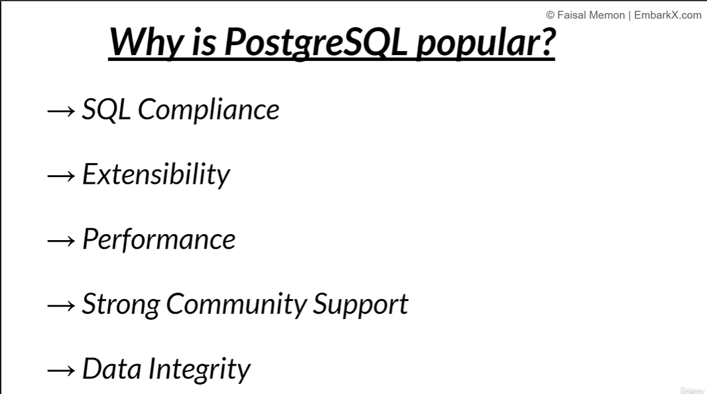
2) 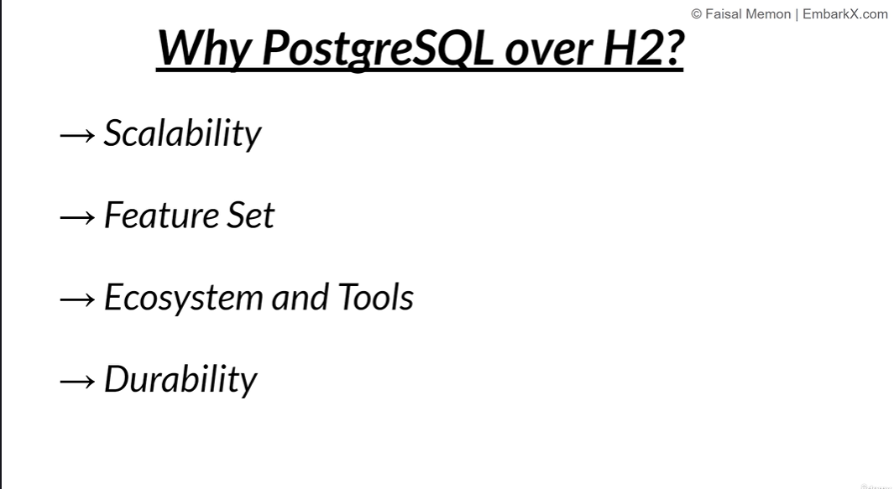
3) 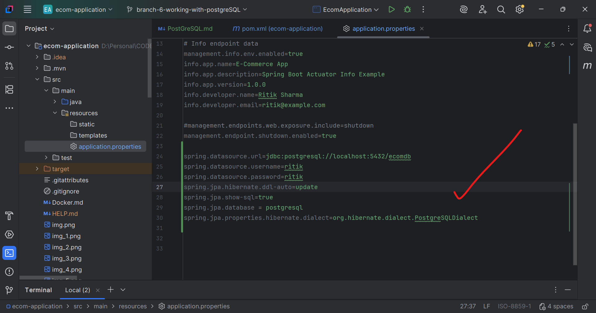

## ----------- Docker Networking for Communication ------
--- 
Got it Ritik 👍 — let’s break down **Docker Network for Communication** with full notes.

---

# 🌐 Docker Networking for Communication

Docker networking allows containers to **talk to each other** and to the **outside world**.

---

## 🔹 Types of Docker Networks

### 1. **Bridge Network (Default)**

* Default network when you run a container without specifying `--network`.
* Containers in the same bridge network can communicate using container name or IP.
* Best for **containers running on the same host**.

👉 Example:

```bash
docker network create my_bridge
docker run -d --name app --network my_bridge nginx
docker run -d --name db --network my_bridge mysql
```

Now, `app` can talk to `db` using hostname `db`.

---

### 2. **Host Network**

* Removes the network isolation between container and host.
* Container shares the **host’s network namespace** (IP and ports).
* Best for **performance** but no isolation.

👉 Example:

```bash
docker run -d --network host nginx
```

---

### 3. **Overlay Network**

* Used in **Docker Swarm** for multi-host communication.
* Containers running on different Docker hosts can communicate.
* Best for **distributed apps / microservices**.

👉 Example:

```bash
docker network create -d overlay my_overlay
```

---

### 4. **Macvlan Network**

* Assigns a **MAC address** to each container so it appears as a physical device on the network.
* Containers get IP addresses from the local LAN.
* Best for when containers need to be treated as separate physical devices.

👉 Example:

```bash
docker network create -d macvlan \
  --subnet=192.168.1.0/24 \
  --gateway=192.168.1.1 \
  -o parent=eth0 my_macvlan
```

---

### 5. **None Network**

* Container has **no network connection**.
* Useful for **security or custom networking**.

👉 Example:

```bash
docker run -d --network none alpine
```

---

## 🔹 How Containers Communicate

1. **Same Network** → use container names as hostnames.

   ```bash
   curl http://db:3306
   ```

2. **Different Networks** → need `docker network connect` to link.

   ```bash
   docker network connect my_bridge app
   ```

3. **External Communication** → expose ports using `-p`.

   ```bash
   docker run -d -p 8080:80 nginx
   ```

---

## 🔹 Key Rules of Docker Networking

* Containers in the **same custom network** can resolve each other by **name**.
* Containers in **different networks** cannot communicate unless connected manually.
* For **cross-host communication**, use **Overlay network** (Swarm/Kubernetes).
* **Port mapping (`-p`)** is needed to make containers accessible to the outside world.

---

✅ **Summary**:

* Use **Bridge** for single-host apps.
* Use **Overlay** for multi-host / microservices.
* Use **Host** for performance-heavy apps.
* Use **Macvlan** if containers need LAN-level visibility.
* Use **None** for security.

---

👉 Do you want me to create a **diagram showing how Docker networks enable container-to-container and container-to-host communication** (like a bridge network setup with an app and database)?

1) start the docker
2) then go to command line to run the postgresql container fo database and write:
   ```docker run -d --name db -e POSTGRES_PASSWORD=ritik postgres:14```
3) 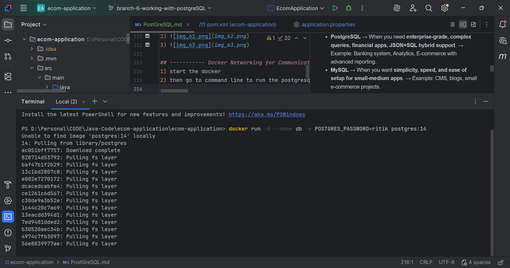
4) 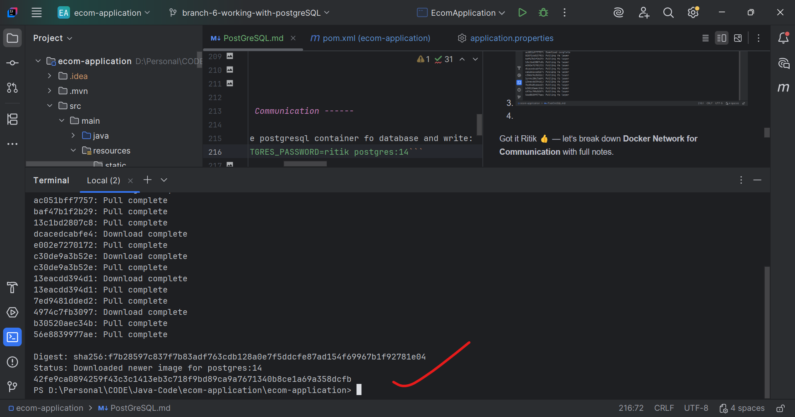
5) 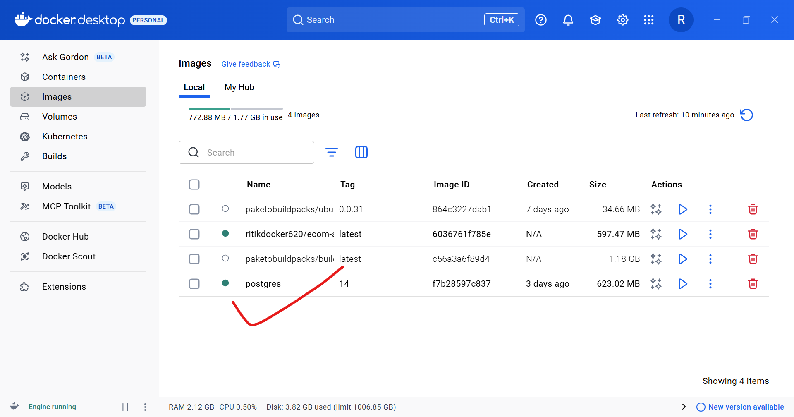
6) 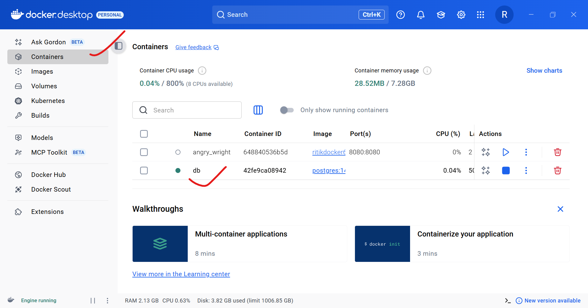
7) if your container(image is running then ok if not so first start the docker application then run the command in comamnd line of application : docker start db)
7) then run one more container
8) PGadmin for the ```docker run  -d --name pgadmin -e PGADMIN_DEFAULT_EMAI=user@domain.com -e PGADMIN_DEFAULT_PASSWORD=ritik dpage/pgadmin4```
9) 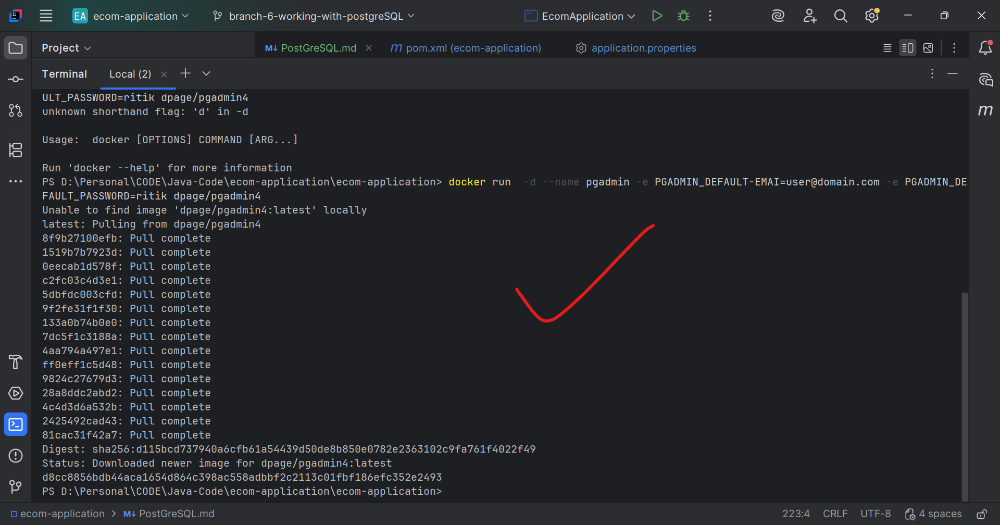
10) 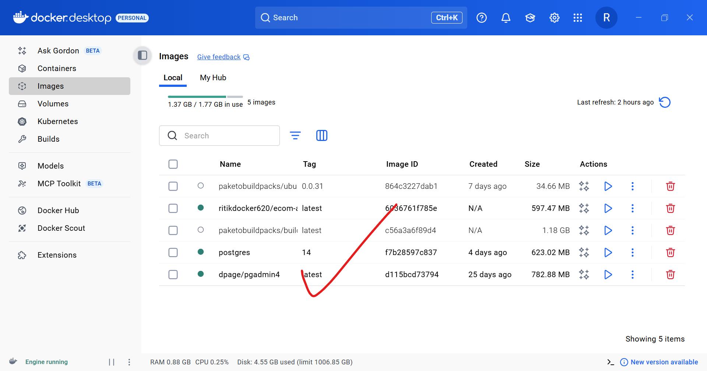
11) 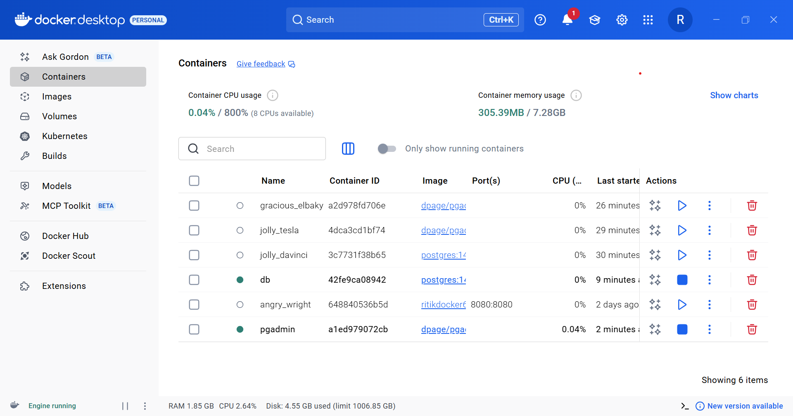
12) if your container(image is running then ok if not so first start the docker application then run the command in comamnd line of application : docker start pgadmin)
12) to communicate two container between each other write: ```docker exec -it pgadmin ping db```
13) 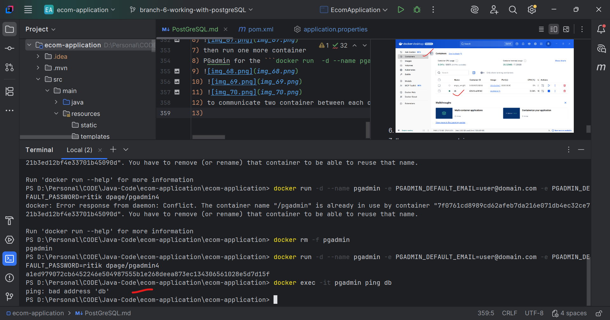
14) to resive it we will use docker network for that we need to create a docker network throw which all container will commnicate to each other.
15) to create a new docker: ```docker network create my-network```
16) 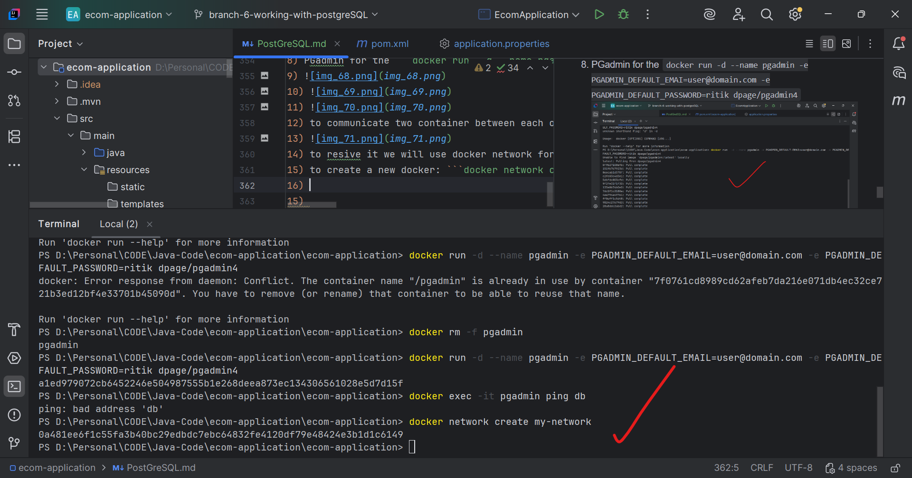
15) now remove the containers which you want to communicate between to each other and if they created only
16) to delete the container: ``docker rm -f containers_name``
17) 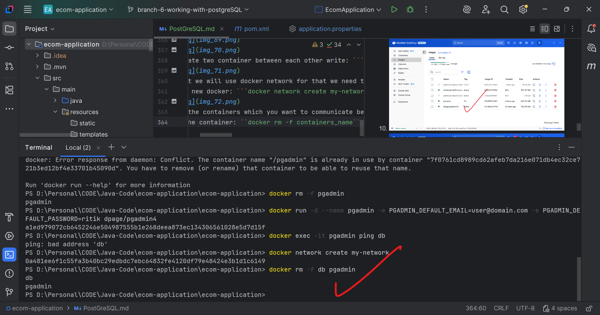
18) 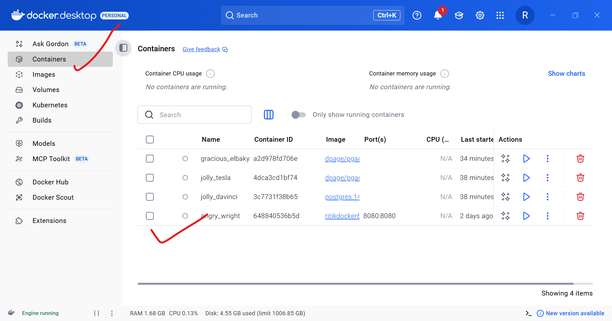
19) now re-create the contianer without creating image of db ```docker run -d --name db --network my-network  -e POSTGRES_PASSWORD=ritik postgres:14```
20) 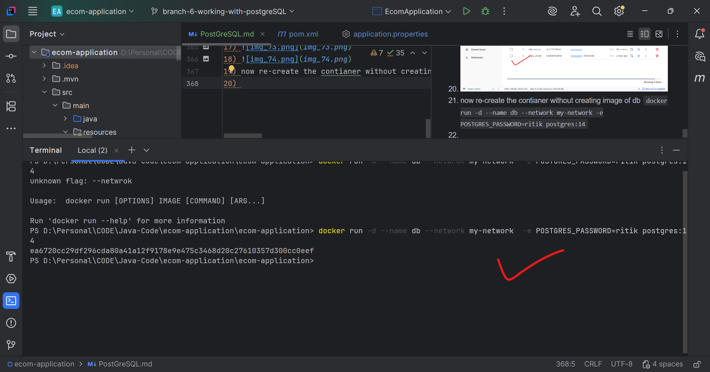
21) same for pgadmin: ```docker run -d --name pgadmin --network my-network  -e PGADMIN_DEFAULT_EMAIL=user@domain.com -e PGADMIN_DEFAULT_PASSWORD=ritik dpage/pgadmin4```
22) 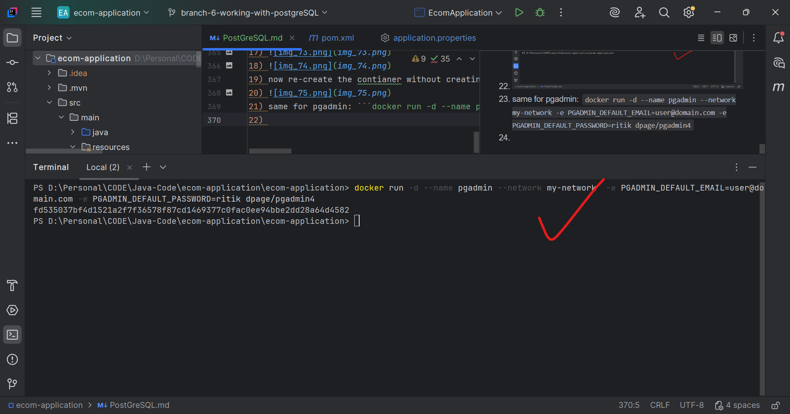
23) 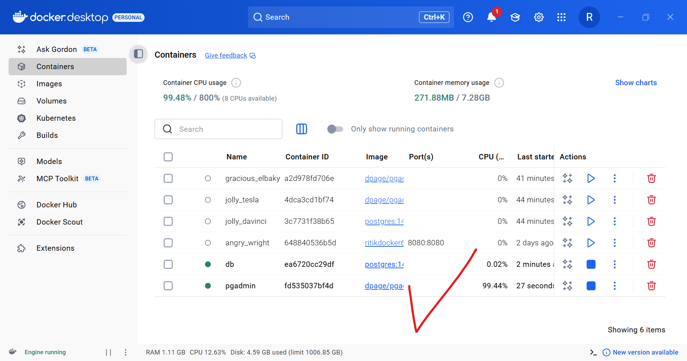
24) now then connect them with each other
25) 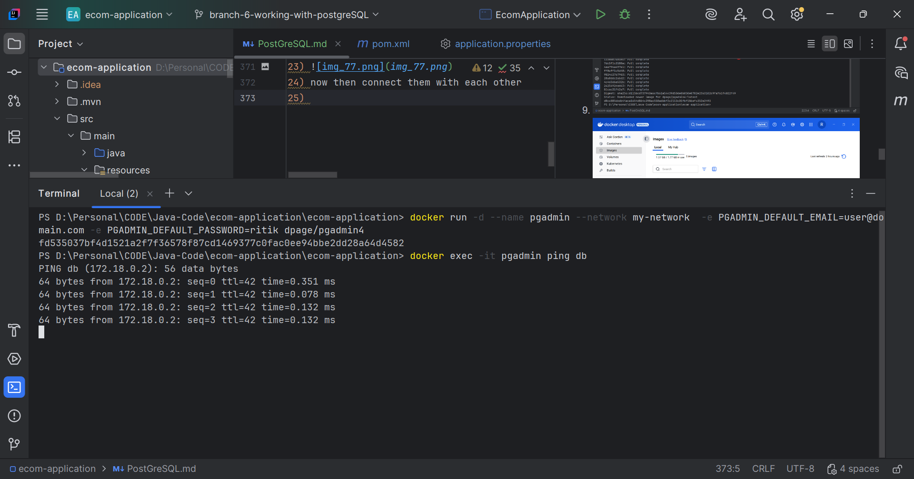
26) then close it 
27) 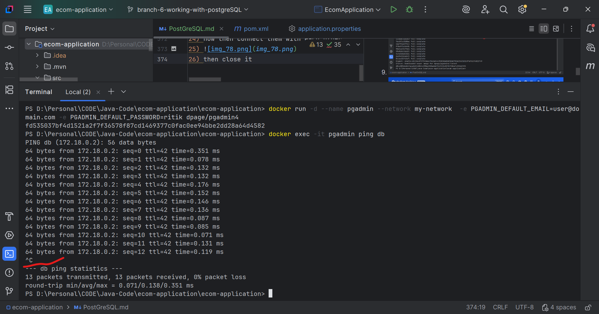

## --- docker run -d --name db -e POSTGRES_PASSWORD = ritik postgre:14 what is this commands explain it --
Great question 👍 Let’s break down the command:

```bash
docker run -d --name db -e POSTGRES_PASSWORD=ritik postgres:14
```

### Explanation of Each Part:

1. **`docker run`**

    * Tells Docker to create and start a new container.

2. **`-d`** (detached mode)

    * Runs the container in the background.
    * Without `-d`, the container would attach to your terminal.

3. **`--name db`**

    * Assigns a custom name to the container (`db`).
    * Makes it easier to refer to instead of using container IDs.

4. **`-e POSTGRES_PASSWORD=ritik`**

    * Sets an environment variable inside the container.
    * `POSTGRES_PASSWORD` is required by the **PostgreSQL image** to set the default password for the `postgres` user.
    * Here, the password is `ritik`.

5. **`postgres:14`**

    * Tells Docker which image to use.
    * `postgres` is the official PostgreSQL image from Docker Hub.
    * `:14` specifies the version (PostgreSQL 14).
    * If you don’t provide a version, Docker pulls the `latest`.

---

### What this command does:

* Runs a PostgreSQL database server (version 14) in a container.
* Names the container **`db`**.
* Sets the default `postgres` user’s password to **`ritik`**.
* Runs in the background (`-d`).
* Exposes PostgreSQL on the default **port 5432** inside the container.

---

⚡ **Example Usage:**
After running this, you can connect to your database like this:

```bash
docker exec -it db psql -U postgres
```

It will prompt for the password → enter `ritik`.

---

👉 Do you want me to also show you how to connect this PostgreSQL container with your **Spring Boot app (using application.properties)**?
## --------- docker -d --name pgadmin -e PGADMIN_DEFAULT_EMAIL = user@domain.com -e PGADMIN_DEFAULT_PASSWORD=ritik dpage/pgadmin4 explain it ----
Perfect 👍 you’re asking about running **pgAdmin** (the PostgreSQL database management UI) in Docker. Let’s break it down:

---

### Command:

```bash
docker run -d --name pgadmin \
  -e PGADMIN_DEFAULT_EMAIL=user@domain.com \
  -e PGADMIN_DEFAULT_PASSWORD=ritik \
  dpage/pgadmin4
```

---

### Explanation of Each Part:

1. **`docker run`**

    * Start a new container.

2. **`-d`**

    * Run in **detached mode** (in the background).

3. **`--name pgadmin`**

    * Assigns the container a name (`pgadmin`) so you don’t need to use the random container ID.

4. **`-e PGADMIN_DEFAULT_EMAIL=user@domain.com`**

    * Environment variable for the default login email to pgAdmin.
    * You’ll use this when logging into the pgAdmin web UI.

5. **`-e PGADMIN_DEFAULT_PASSWORD=ritik`**

    * Environment variable for the default login password to pgAdmin.
    * Paired with the above email for authentication.

6. **`dpage/pgadmin4`**

    * The Docker image for **pgAdmin 4**, which is the web-based GUI tool for managing PostgreSQL databases.
    * `dpage` is the maintainer namespace on Docker Hub.
    * `pgadmin4` is the image name.

---

### What this command does:

* Starts a container running **pgAdmin 4**.
* Makes it accessible in a browser (default port: **80 inside the container**).
* Sets login credentials as:

    * **Email**: `user@domain.com`
    * **Password**: `ritik`

---

### Accessing pgAdmin:

After starting, you can access pgAdmin from your host machine’s browser:

👉 If you don’t expose ports, add `-p` to map them:

```bash
docker run -d --name pgadmin \
  -p 8080:80 \
  -e PGADMIN_DEFAULT_EMAIL=user@domain.com \
  -e PGADMIN_DEFAULT_PASSWORD=ritik \
  dpage/pgadmin4
```

* Now open: **[http://localhost:8080](http://localhost:8080)**
* Login with the email + password you set.

---

### Use Case:

* **pgAdmin** is like a GUI client (similar to MySQL Workbench) but for PostgreSQL.
* Instead of only using `psql` CLI, you get a **web-based dashboard** to:

    * Create/manage databases
    * Run SQL queries
    * Manage users/roles
    * Monitor PostgreSQL performance

---

👉 Do you want me to also explain **how to connect this pgAdmin container with your PostgreSQL container (`db`)** so you can manage that DB from pgAdmin?

## ------- Runing postgreSQl locally -------
1) 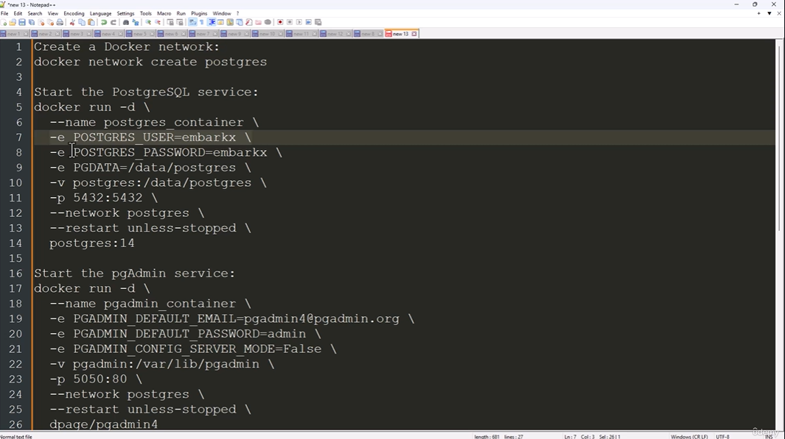
2) there is other ways to run the contianers accept to above ways on the images that is docker compose

## -------- runing differentees containers throw the sigle file ------
Ah! I see what you want: you want to **run multiple containers (PostgreSQL + pgAdmin, maybe more) defined in a single file**, instead of running separate `docker run` commands. The standard way to do this is using **Docker Compose**.

Here’s how you can do it:

---

### **Step 1: Create a `docker-compose.yml` file**

```yaml
version: "3.9"

services:
  db:
    image: postgres:14
    container_name: db
    restart: always
    environment:
      POSTGRES_PASSWORD: ritik
      POSTGRES_USER: ritik
      POSTGRES_DB: mydatabase
    ports:
      - "5432:5432"

  pgadmin:
    image: dpage/pgadmin4
    container_name: pgadmin
    restart: always
    environment:
      PGADMIN_DEFAULT_EMAIL: user@domain.com
      PGADMIN_DEFAULT_PASSWORD: ritik
    ports:
      - "8080:80"
    depends_on:
      - db
```

---

### **Step 2: Run the containers**

From the folder where `docker-compose.yml` is located:

```bash
docker-compose up -d
```

* `-d` runs them in detached mode (background).
* `depends_on` ensures pgAdmin starts after the database.

---

### **Step 3: Access services**

* PostgreSQL: `localhost:5432`
* pgAdmin: `http://localhost:8080`

In pgAdmin, use **host `db`**, username/password from the compose file to connect to PostgreSQL.

---

✅ This way, you only maintain **one file** to run multiple containers, and it avoids naming conflicts or environment variable mistakes.

If you want, I can make an **enhanced version with volumes** so your database and pgAdmin data persist even if you restart the containers.

Do you want me to do that?

---
Q:1 i have already application.property so should i create new file as docker-compose.yml
No, you **don’t need to touch your `application.properties`**—that’s for your Spring Boot application configuration.

`docker-compose.yml` is a **completely separate file** used by Docker to define and run multiple containers. You can create it in the **root folder of your project** (next to your Spring Boot project files).

Here’s how it works together:

* `application.properties` → Spring Boot settings (like DB URL, username, password).
* `docker-compose.yml` → Docker containers (PostgreSQL, pgAdmin, or any other service).

For example, in `application.properties` you might have:

```properties
spring.datasource.url=jdbc:postgresql://localhost:5432/mydatabase
spring.datasource.username=ritik
spring.datasource.password=ritik
```

And in `docker-compose.yml` you have PostgreSQL configured with the **same credentials**.

---

✅ So yes, **create a new file named `docker-compose.yml`** in your project root—it won’t conflict with your Spring Boot properties.

If you want, I can write a **ready-to-use `docker-compose.yml` for your Spring Boot + PostgreSQL + pgAdmin setup** that matches your current `application.properties`.

----
From your screenshot, your project structure looks like this:

```
ecom-application
│
├─ .idea
├─ .mvn
├─ src
│   └─ main
│       └─ resources
│           └─ application.properties
├─ target
├─ pom.xml
```

---

### Where to create `docker-compose.yml`

You should create it **at the root of your project**, **next to `pom.xml`**. So the structure will look like this:

```
ecom-application
│
├─ docker-compose.yml   <-- create it here
├─ pom.xml
├─ src
│   └─ main
│       └─ resources
│           └─ application.properties
...
```

This way:

* Docker Compose can find it easily.
* It doesn’t interfere with your Spring Boot files.
* All containers (PostgreSQL, pgAdmin, etc.) will be defined in one file.

---

If you want, I can write a **ready-to-use `docker-compose.yml`** for your current setup with the credentials in `application.properties`. Do you want me to do that?
--- 
## ------- docker-compose.yml file ----
```declarative
version: '3.8'

services:
  postgres:
    container_name: postgres_container
    image: postgres:14
    environment:
      POSTGRES_USER: embarkx
      POSTGRES_PASSWORD: embarkx
      POSTGRES_DB: embarkx
      PGDATA: /data/postgres
    volumes:
      - postgres_data:/data/postgres
    ports:
      - "5432:5432"
    networks:
      - postgres_network
    restart: unless-stopped

  pgadmin:
    container_name: pgadmin_container
    image: dpage/pgadmin4
    environment:
      PGADMIN_DEFAULT_EMAIL: ${PGADMIN_DEFAULT_EMAIL:-admin@pgadmin.org}
      PGADMIN_DEFAULT_PASSWORD: ${PGADMIN_DEFAULT_PASSWORD:-admin}
      PGADMIN_CONFIG_SERVER_MODE: 'False'
    volumes:
      - pgadmin_data:/var/lib/pgadmin
    ports:
      - "5050:80"
    networks:
      - postgres_network
    restart: unless-stopped
    depends_on:
      - postgres

volumes:
  postgres_data:
  pgadmin_data:

networks:
  postgres_network:
    driver: bridge


```

---
1) now we need to run the commans as ```docker compose up```
2) 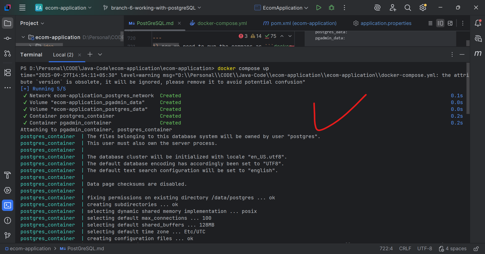
3) 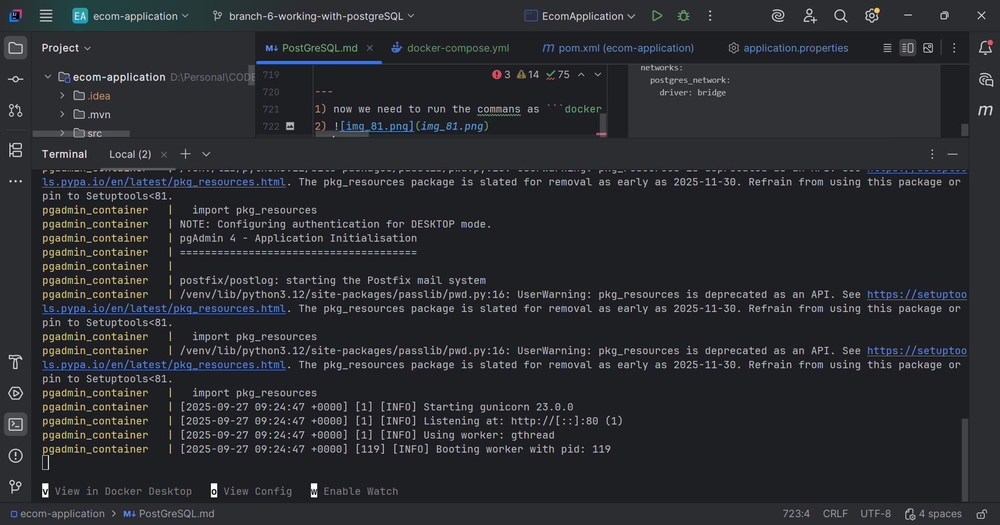
4) 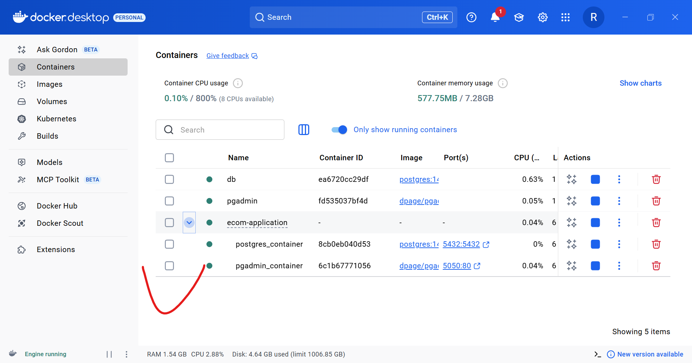
5) we can run it by ```docker compose up -d ```
6) 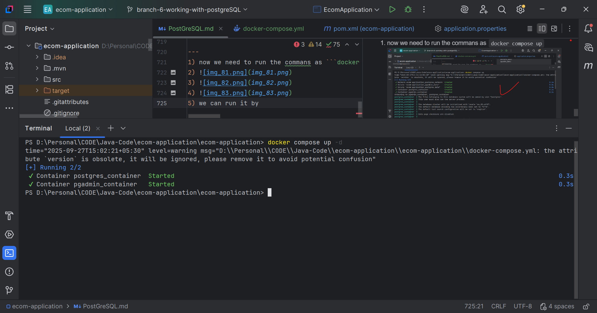
7) 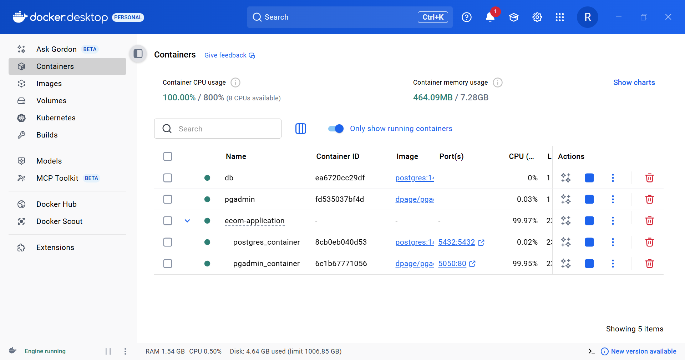
8) to close the container ``` docker compose down```
9) 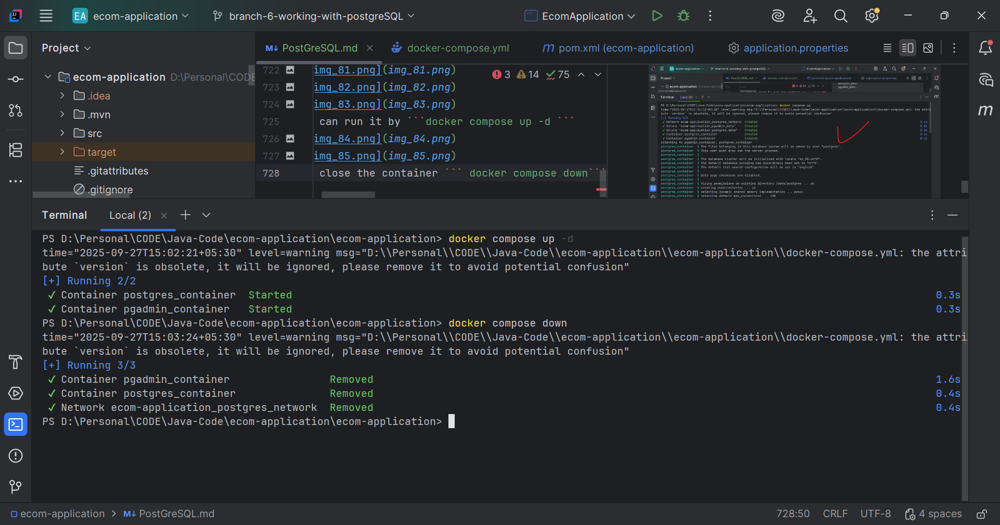
10) 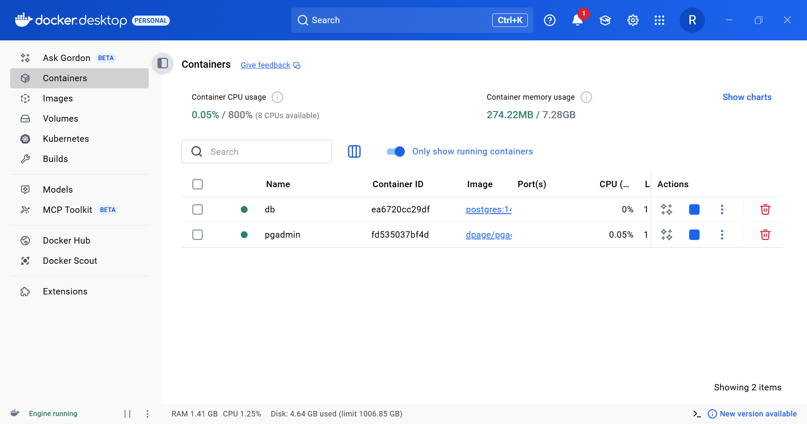
11) 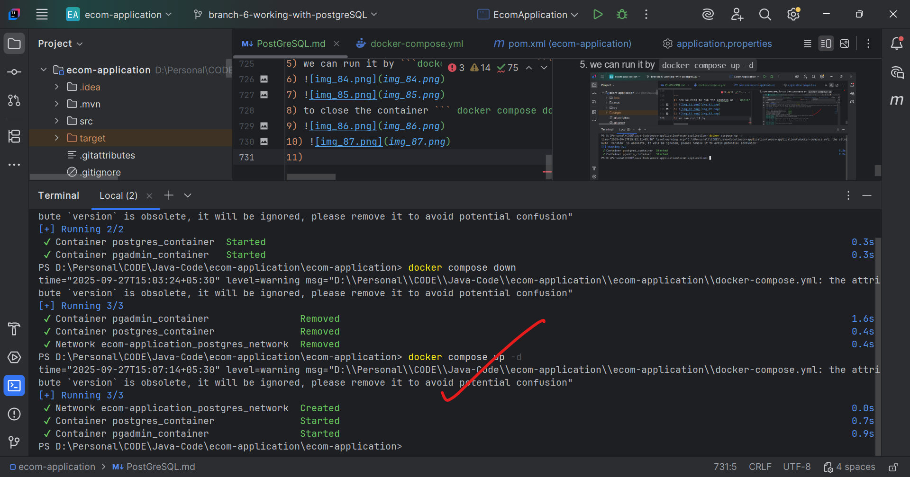
12) 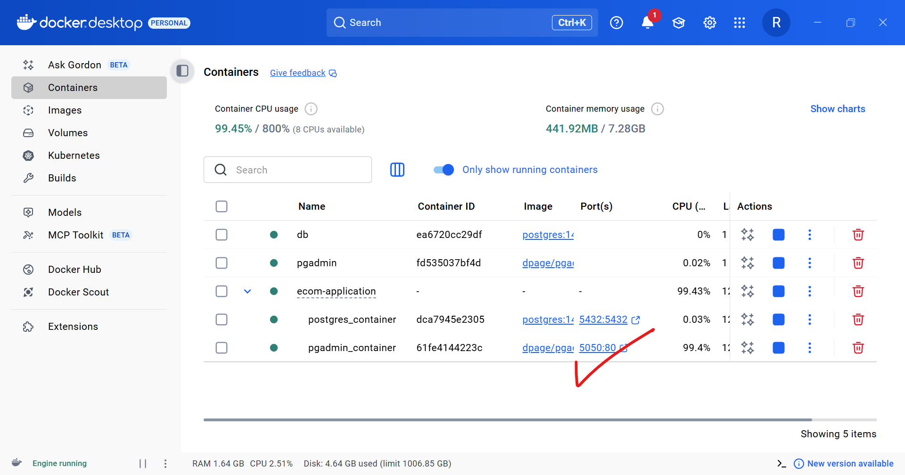
13) 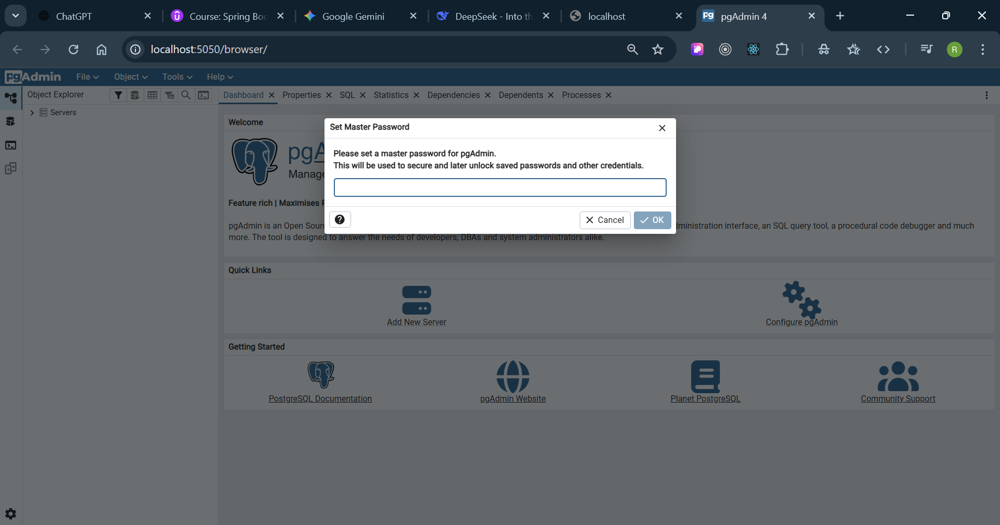
14) create a server into the postgresql 
15) 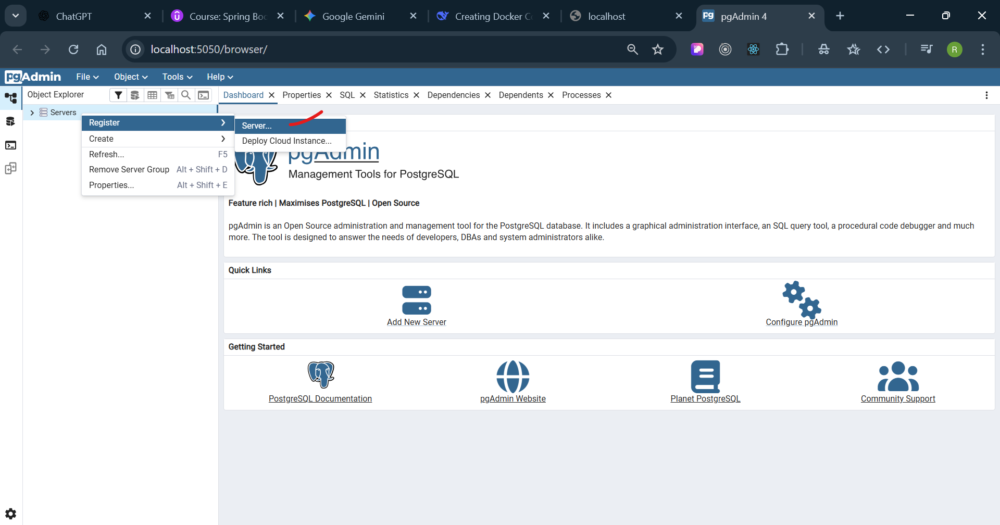
16) 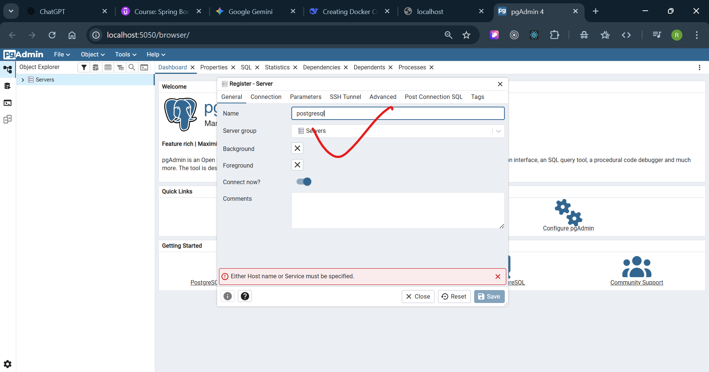
17) 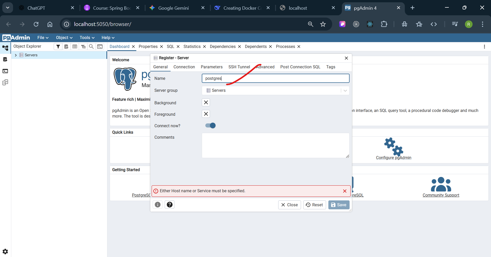
18) 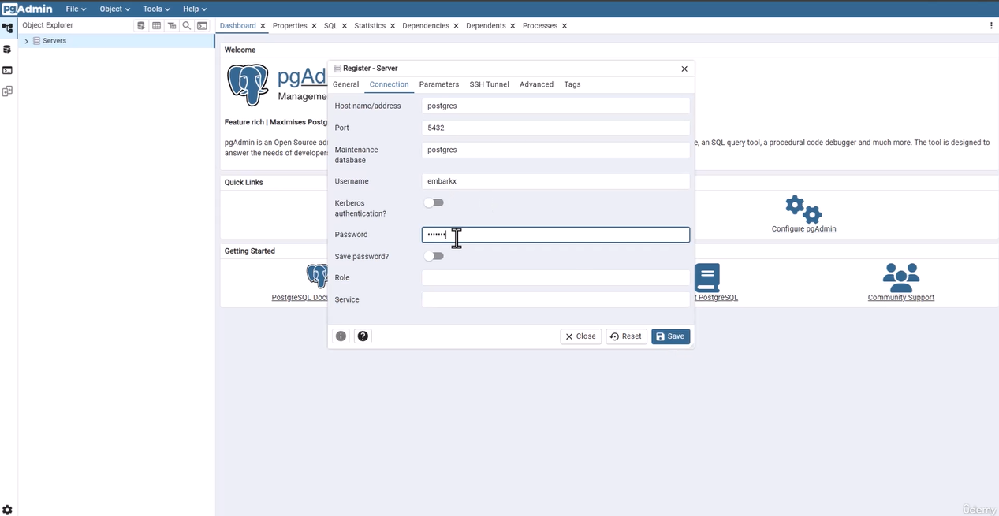
19) 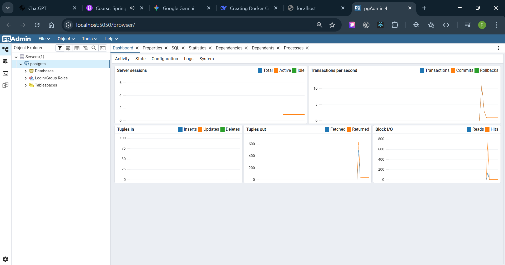
20) now we need to crate a database with respect to our database as below image
21) 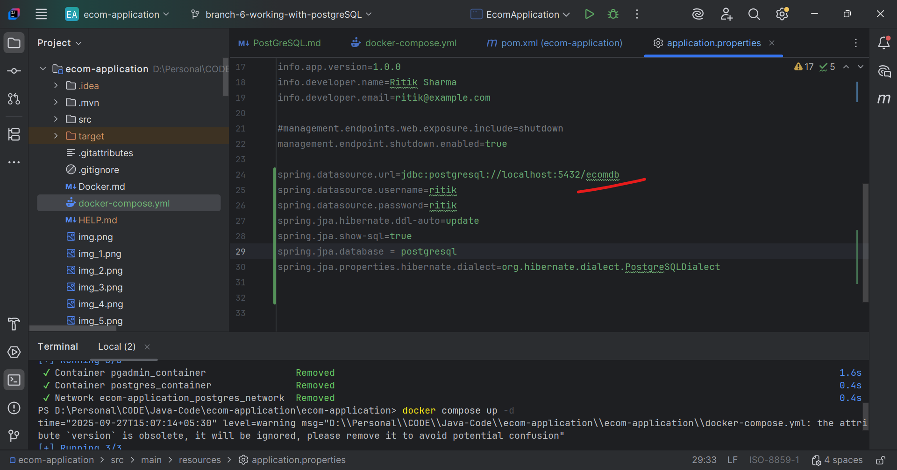
22) 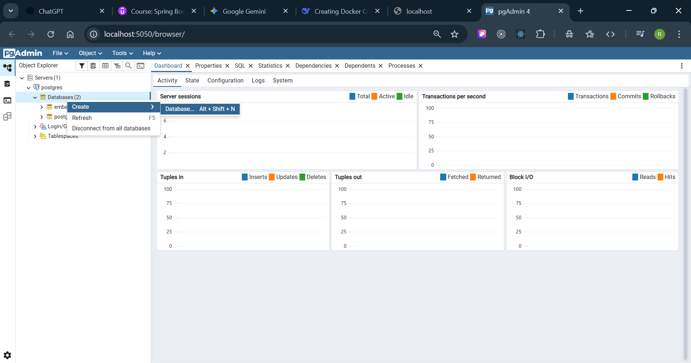
23) 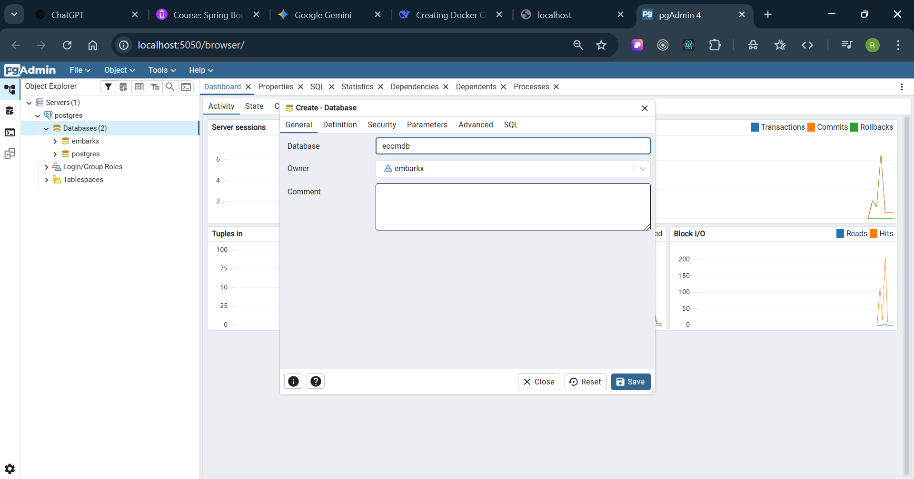
24) 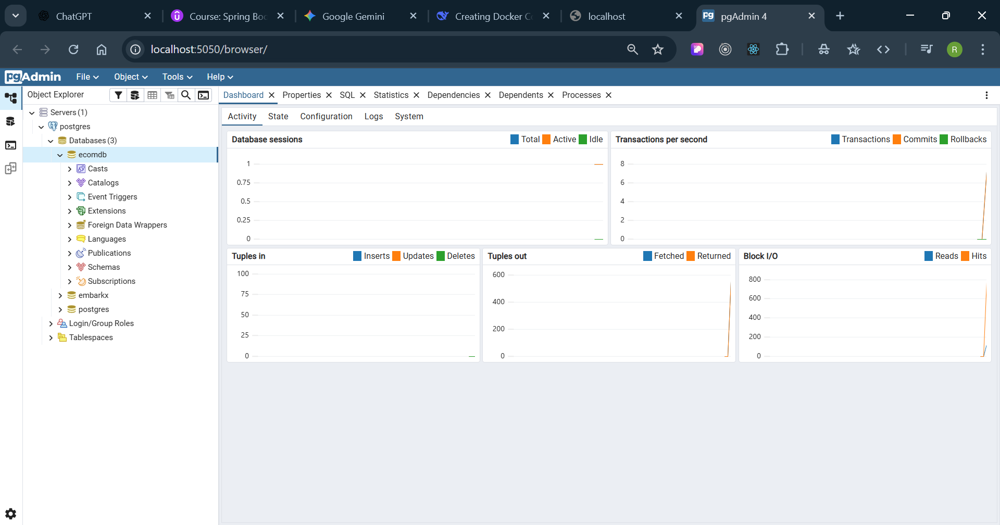
25) 